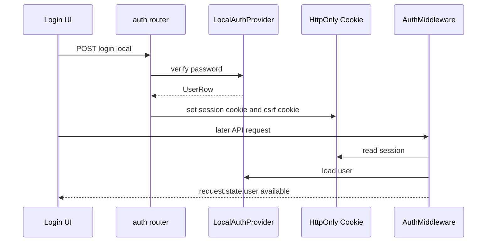
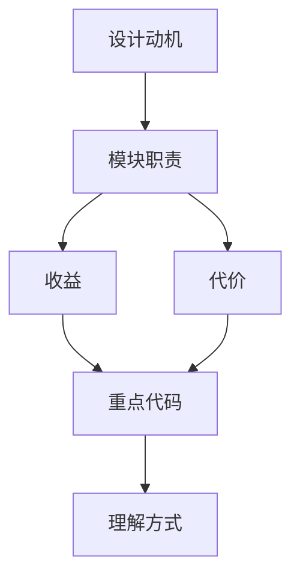

<title>48｜Gateway Auth Router 与认证模块详解</title>

<callout emoji="✅">
**本章目标：**把 auth.py、AuthMiddleware、CSRF、本地用户 provider 的协作讲清。
</callout>

| 模块 | 职责 |
|-|-|
| `routers/auth.py` | 登录、注册、退出、修改密码、初始化 admin、OAuth callback。 |
| `auth_middleware.py` | 请求级认证，把 user 写入 request.state。 |
| `csrf_middleware.py` | 状态变更请求 CSRF 校验。 |
| `auth/local_provider.py` | 本地用户认证 provider。 |
| `auth/password.py` | 密码 hash 和校验。 |

---

# 补充：设计取舍、重点代码与阅读路径

<callout emoji="💡">
**设计目的：**这个模块采用 router/API 分层，是为了把 HTTP 边界、鉴权、请求响应模型和内部服务逻辑分开。
</callout>

| 维度 | 说明 |
|-|-|
| 收益 | 收益是接口职责清晰，前端和外部 SDK 可稳定调用。 |
| 代价 | 代价是一次业务流常跨 router、service、runtime、repository 多层。 |
| 重点代码 | 重点代码在 `backend/app/gateway/routers/` 与 `backend/app/gateway/services.py`。 |
| 阅读路径 | 阅读路径：从 URL 路径找 router，再看 request model、authz、依赖注入和 service 调用。 |

