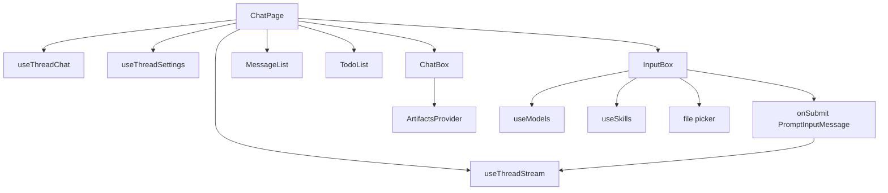
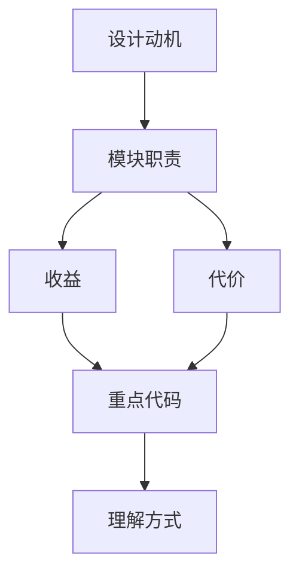

<title>50｜Frontend ChatPage 与 InputBox 文件详解</title>

<callout emoji="✅">
**本章目标：**把用户聊天页主装配和输入框上下文构造拆开讲。
</callout>

| 文件 | 职责 |
|-|-|
| `app/workspace/chats/[thread_id]/page.tsx` | ChatPage 主装配：thread 状态、settings、MessageList、InputBox、Todo、Artifacts。 |
| `components/workspace/input-box.tsx` | 文本输入、模型选择、mode/reasoning effort、文件上传、skill suggestion。 |
| `components/workspace/chats/use-thread-chat.ts` | /new 临时 thread id 和 URL replace。 |
| `components/workspace/chats/chat-box.tsx` | 聊天区和 artifacts 右侧面板布局。 |

---

# 补充：设计取舍、重点代码与阅读路径

<callout emoji="💡">
**设计目的：**这个模块采用 router/API 分层，是为了把 HTTP 边界、鉴权、请求响应模型和内部服务逻辑分开。
</callout>

| 维度 | 说明 |
|-|-|
| 收益 | 收益是接口职责清晰，前端和外部 SDK 可稳定调用。 |
| 代价 | 代价是一次业务流常跨 router、service、runtime、repository 多层。 |
| 重点代码 | 重点代码在 `backend/app/gateway/routers/` 与 `backend/app/gateway/services.py`。 |
| 阅读路径 | 阅读路径：从 URL 路径找 router，再看 request model、authz、依赖注入和 service 调用。 |

