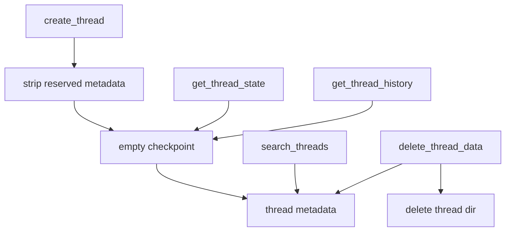
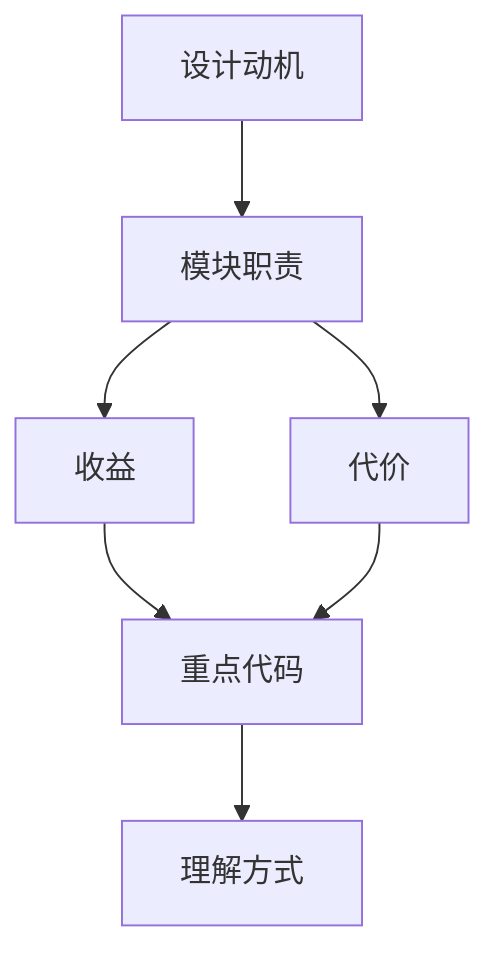

<title>52｜threads.py Router 单文件详解</title>

<callout emoji="✅">
**本章目标：**单独讲清 threads.py 的接口职责、数据流和修改风险。
</callout>

# 1. 接口职责

| 接口 | 职责 |
|-|-|
| `POST /api/threads` | 创建 thread。 |
| `POST /api/threads/search` | 搜索 thread metadata。 |
| `GET /{id}/state` | 读取 checkpoint state。 |
| `POST /{id}/history` | 读取 history。 |
| `DELETE /{id}` | 删除 LangGraph/thread local data。 |

# 2. 运行逻辑图

# 3. 修改建议

- 先改 Pydantic request/response，再改 handler。
- 涉及用户数据必须确认 owner check 或 current user。
- 前端调用方要同步更新 core API/hook。

---

# 补充：设计取舍、重点代码与阅读路径

<callout emoji="💡">
**设计目的：**这个模块采用 router/API 分层，是为了把 HTTP 边界、鉴权、请求响应模型和内部服务逻辑分开。
</callout>

| 维度 | 说明 |
|-|-|
| 收益 | 收益是接口职责清晰，前端和外部 SDK 可稳定调用。 |
| 代价 | 代价是一次业务流常跨 router、service、runtime、repository 多层。 |
| 重点代码 | 重点代码在 `backend/app/gateway/routers/` 与 `backend/app/gateway/services.py`。 |
| 阅读路径 | 阅读路径：从 URL 路径找 router，再看 request model、authz、依赖注入和 service 调用。 |

