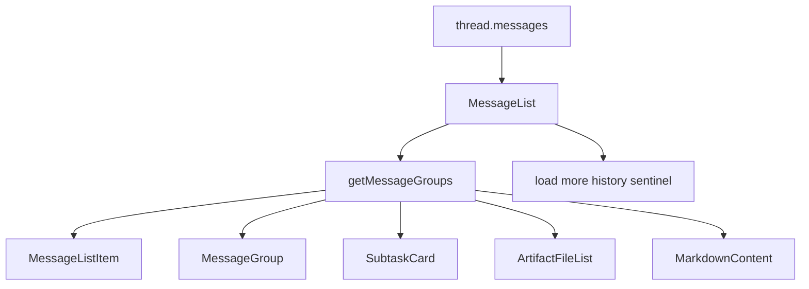
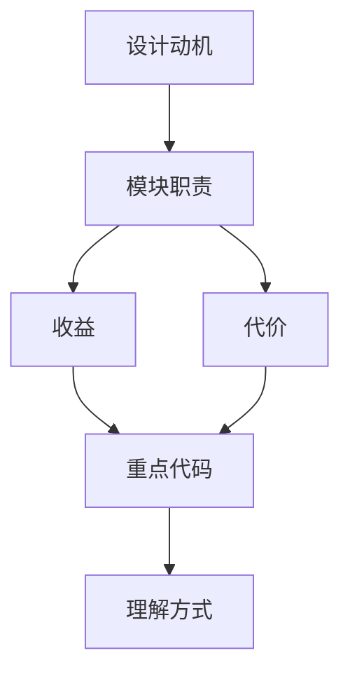

<title>58｜Frontend Message Components 单文件详解</title>

<callout emoji="✅">
**本章目标：**单独讲清 Message components 的接口职责、数据流和修改风险。
</callout>

# 1. 接口职责

| 组件 | 职责 |
|-|-|
| `message-list.tsx` | 总体消息列表、历史加载、分组渲染。 |
| `message-list-item.tsx` | 单条 human/assistant 消息展示。 |
| `message-group.tsx` | reasoning/tool call 过程展示。 |
| `subtask-card.tsx` | task/subagent 状态卡片。 |
| `markdown-content.tsx` | Markdown 渲染。 |

# 2. 运行逻辑图

# 3. 修改建议

- 先改 Pydantic request/response，再改 handler。
- 涉及用户数据必须确认 owner check 或 current user。
- 前端调用方要同步更新 core API/hook。

---

# 补充：设计取舍、重点代码与阅读路径

<callout emoji="💡">
**设计目的：**前端模块按页面、core hooks、组件拆分，是为了分离路由装配、数据状态和展示组件。
</callout>

| 维度 | 说明 |
|-|-|
| 收益 | 收益是组件复用和状态管理更清晰。 |
| 代价 | 代价是一次交互会跨 React Query、localStorage、useStream 和多个组件。 |
| 重点代码 | 重点代码在 `frontend/src/app`、`frontend/src/core`、`frontend/src/components/workspace`。 |
| 阅读路径 | 阅读路径：先找页面入口，再找 hook 数据源，最后看组件如何消费 props/state。 |

