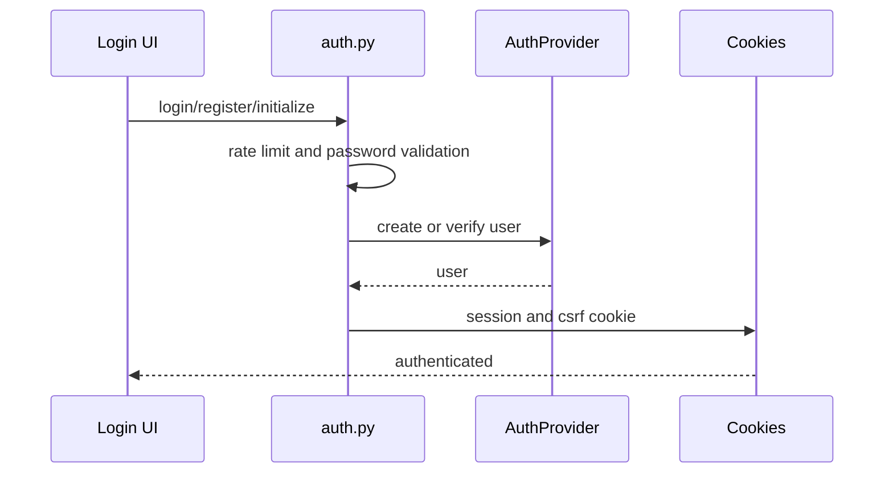
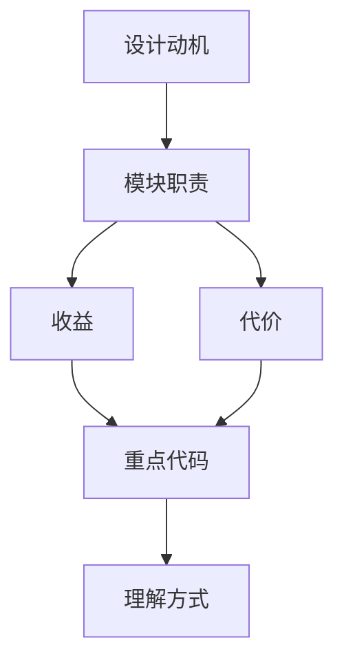

<title>61｜auth.py Router 单文件详解</title>

<callout emoji="✅">
**本章目标：**单独讲清本地登录、注册、初始化、OAuth callback 和安全限制。
</callout>

# 1. 模块职责

| 对象 | 说明 |
|-|-|
| `login_local` | 表单登录，校验密码，设置 HttpOnly session cookie。 |
| `register` | 注册普通用户。 |
| `initialize_admin` | 首次启动初始化 admin。 |
| `change_password` | 修改密码并刷新会话。 |
| `oauth_login/callback` | OAuth provider 登录入口。 |

# 2. 运行逻辑图

# 3. 排障与修改建议

- 先确认调用方和数据源，再改 schema。
- 涉及用户数据必须确认鉴权和 owner check。
- 涉及缓存需要同步 invalidate 或 reset。

---

# 补充：设计取舍、重点代码与阅读路径

<callout emoji="💡">
**设计目的：**这个模块采用 router/API 分层，是为了把 HTTP 边界、鉴权、请求响应模型和内部服务逻辑分开。
</callout>

| 维度 | 说明 |
|-|-|
| 收益 | 收益是接口职责清晰，前端和外部 SDK 可稳定调用。 |
| 代价 | 代价是一次业务流常跨 router、service、runtime、repository 多层。 |
| 重点代码 | 重点代码在 `backend/app/gateway/routers/` 与 `backend/app/gateway/services.py`。 |
| 阅读路径 | 阅读路径：从 URL 路径找 router，再看 request model、authz、依赖注入和 service 调用。 |

