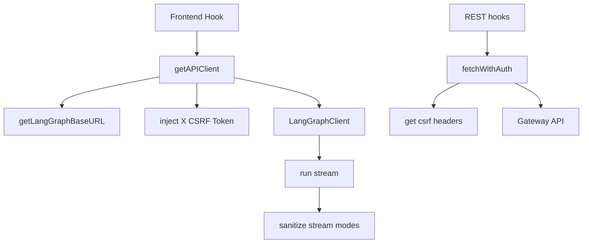
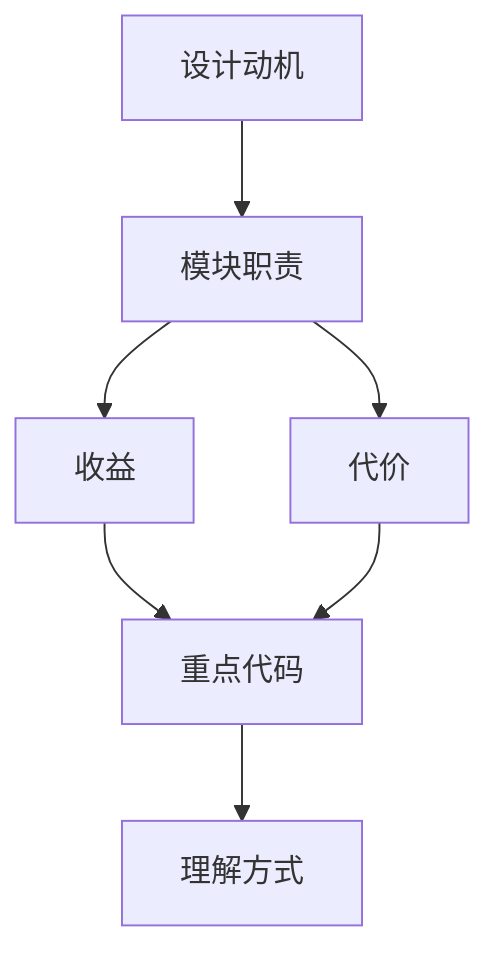

<title>64｜Frontend API Client 与 Fetcher 详解</title>

<callout emoji="✅">
**本章目标：**讲清 LangGraph SDK client、CSRF 注入、普通 REST fetcher 和 stream mode 清洗。
</callout>

# 1. 模块职责

| 对象 | 说明 |
|-|-|
| `api-client.ts` | 创建 LangGraphClient，包装 runs.stream/joinStream。 |
| `fetcher.ts` | 普通 REST fetch，自动带 credentials/CSRF。 |
| `stream-mode.ts` | 过滤不支持的 stream modes。 |
| `config/index.ts` | 解析 Backend/LangGraph base URL。 |
| `static-mode` | 静态站点 mock client fallback。 |

# 2. 运行逻辑图

# 3. 排障与修改建议

- 先确认调用方和数据源，再改 schema。
- 涉及用户数据必须确认鉴权和 owner check。
- 涉及缓存需要同步 invalidate 或 reset。

---

# 补充：设计取舍、重点代码与阅读路径

<callout emoji="💡">
**设计目的：**这个模块采用 router/API 分层，是为了把 HTTP 边界、鉴权、请求响应模型和内部服务逻辑分开。
</callout>

| 维度 | 说明 |
|-|-|
| 收益 | 收益是接口职责清晰，前端和外部 SDK 可稳定调用。 |
| 代价 | 代价是一次业务流常跨 router、service、runtime、repository 多层。 |
| 重点代码 | 重点代码在 `backend/app/gateway/routers/` 与 `backend/app/gateway/services.py`。 |
| 阅读路径 | 阅读路径：从 URL 路径找 router，再看 request model、authz、依赖注入和 service 调用。 |

