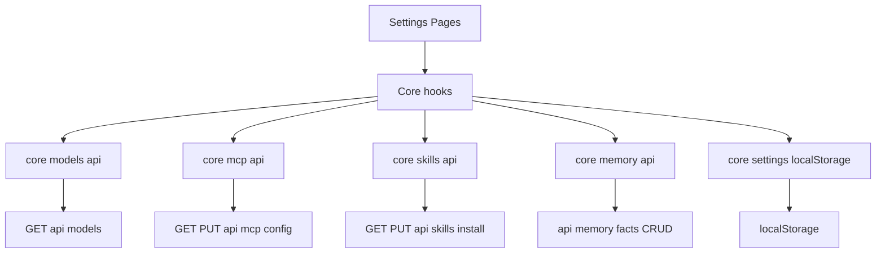
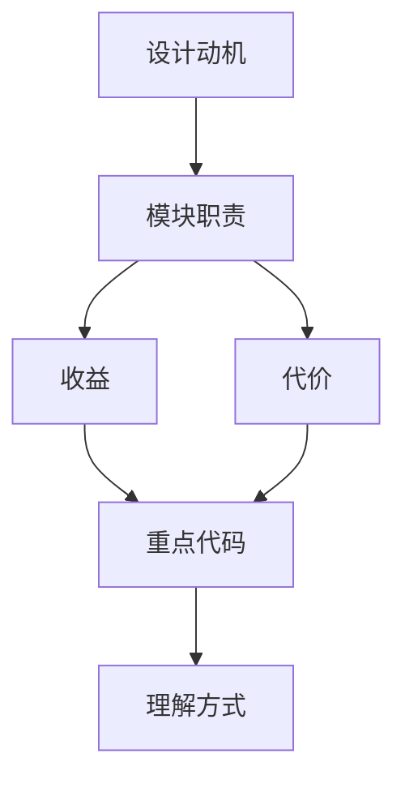

<title>65｜Frontend Core Settings/Models/MCP/Skills/Memory API 层详解</title>

<callout emoji="✅">
**本章目标：**讲清前端 core data layer 如何和后端 Settings API 对接。
</callout>

# 1. 模块职责

| 对象 | 说明 |
|-|-|
| `core/settings/*` | local settings、thread model override、hooks。 |
| `core/models/*` | loadModels 与 token usage enabled。 |
| `core/mcp/*` | load/update MCP config。 |
| `core/skills/*` | load/enable/install skills。 |
| `core/memory/*` | memory/facts CRUD、import/export。 |

# 2. 运行逻辑图

# 3. 排障与修改建议

- 先确认调用方和数据源，再改 schema。
- 涉及用户数据必须确认鉴权和 owner check。
- 涉及缓存需要同步 invalidate 或 reset。

---

# 补充：设计取舍、重点代码与阅读路径

<callout emoji="💡">
**设计目的：**前端模块按页面、core hooks、组件拆分，是为了分离路由装配、数据状态和展示组件。
</callout>

| 维度 | 说明 |
|-|-|
| 收益 | 收益是组件复用和状态管理更清晰。 |
| 代价 | 代价是一次交互会跨 React Query、localStorage、useStream 和多个组件。 |
| 重点代码 | 重点代码在 `frontend/src/app`、`frontend/src/core`、`frontend/src/components/workspace`。 |
| 阅读路径 | 阅读路径：先找页面入口，再找 hook 数据源，最后看组件如何消费 props/state。 |

