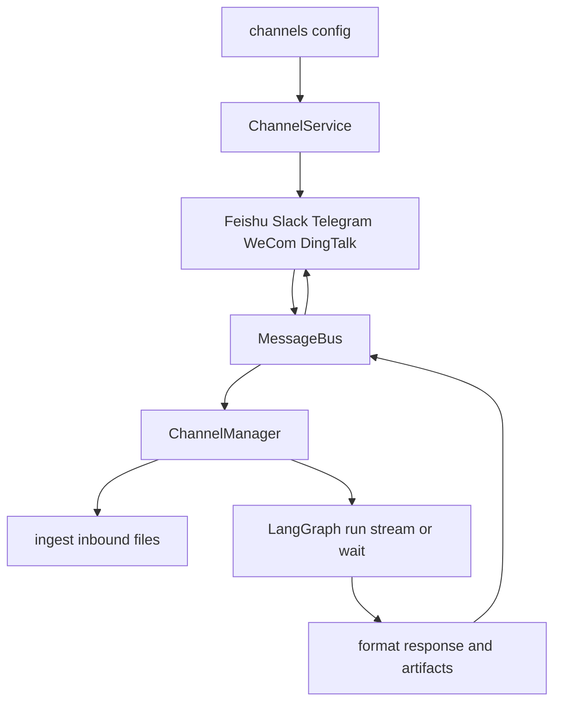
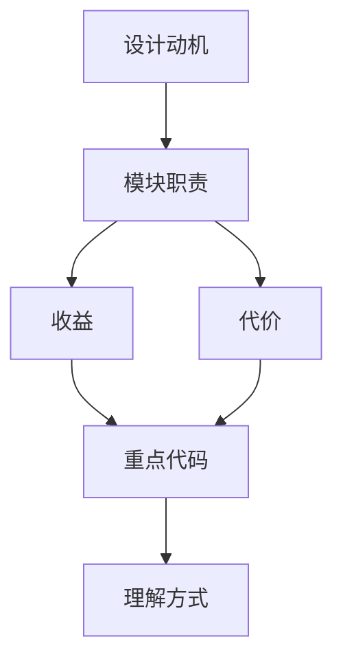

<title>68｜Channels Service 与 ChannelManager 详解</title>

<callout emoji="✅">
**本章目标：**讲清 IM channel service 如何启动、统一消息如何转为 LangGraph run。
</callout>

# 1. 模块职责

| 模块 | 说明 |
|-|-|
| `service.py` | 启动/停止 ChannelService，按 config 初始化 channels。 |
| `manager.py` | 统一处理 inbound message、slash skill、attachments、artifact delivery。 |
| `message_bus.py` | InboundMessage/OutboundMessage 数据结构和 MessageBus。 |
| `store.py` | channel 状态存储。 |

# 2. 运行逻辑图

---

# 补充：设计取舍、重点代码与阅读路径

<callout emoji="💡">
**设计目的：**前端模块按页面、core hooks、组件拆分，是为了分离路由装配、数据状态和展示组件。
</callout>

| 维度 | 说明 |
|-|-|
| 收益 | 收益是组件复用和状态管理更清晰。 |
| 代价 | 代价是一次交互会跨 React Query、localStorage、useStream 和多个组件。 |
| 重点代码 | 重点代码在 `frontend/src/app`、`frontend/src/core`、`frontend/src/components/workspace`。 |
| 阅读路径 | 阅读路径：先找页面入口，再找 hook 数据源，最后看组件如何消费 props/state。 |

