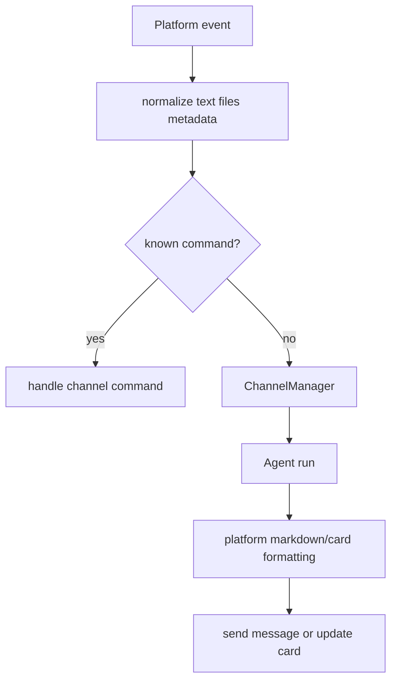
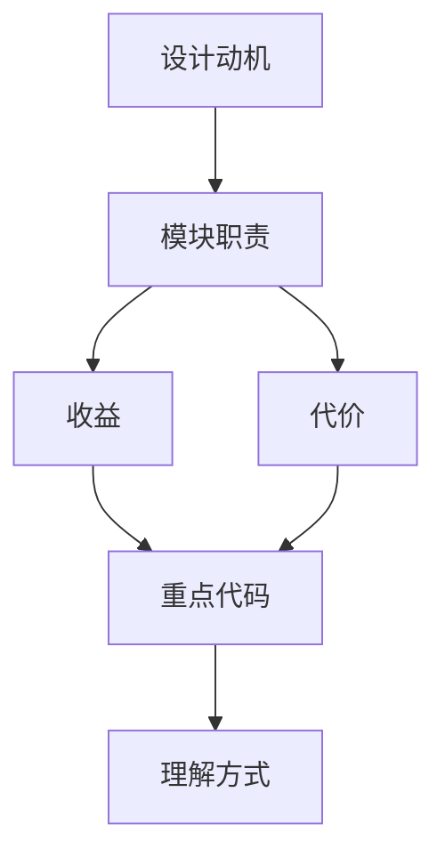

<title>69｜Feishu/Slack/Telegram/WeCom/DingTalk/Wechat Channel 详解</title>

<callout emoji="✅">
**本章目标：**逐个平台讲清输入输出、命令识别和消息适配差异。
</callout>

# 1. 模块职责

| 模块 | 说明 |
|-|-|
| Feishu | WebSocket 事件，流式更新卡片，支持 OK/DONE reaction。 |
| Slack | Socket Mode，处理 bot mention 和 allowed users。 |
| Telegram | Bot API long polling。 |
| WeCom | 企业微信智能机器人。 |
| DingTalk | Stream Push，Markdown 表格适配。 |
| Wechat | iLink/媒体加解密相关逻辑。 |

# 2. 运行逻辑图

---

# 补充：设计取舍、重点代码与阅读路径

<callout emoji="💡">
**设计目的：**这个模块单独成章，是为了把职责边界、运行逻辑和维护入口从大系统里抽出来。
</callout>

| 维度 | 说明 |
|-|-|
| 收益 | 收益是查找和学习更快，职责更聚焦。 |
| 代价 | 代价是章节数量增加，需要依赖目录和索引维护。 |
| 重点代码 | 重点代码见本章表格列出的源码路径。 |
| 阅读路径 | 阅读路径：先确认它在系统链路中的上游和下游，再看关键函数。 |

