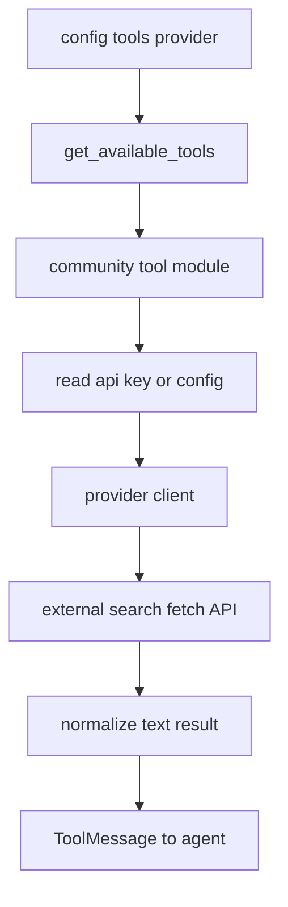
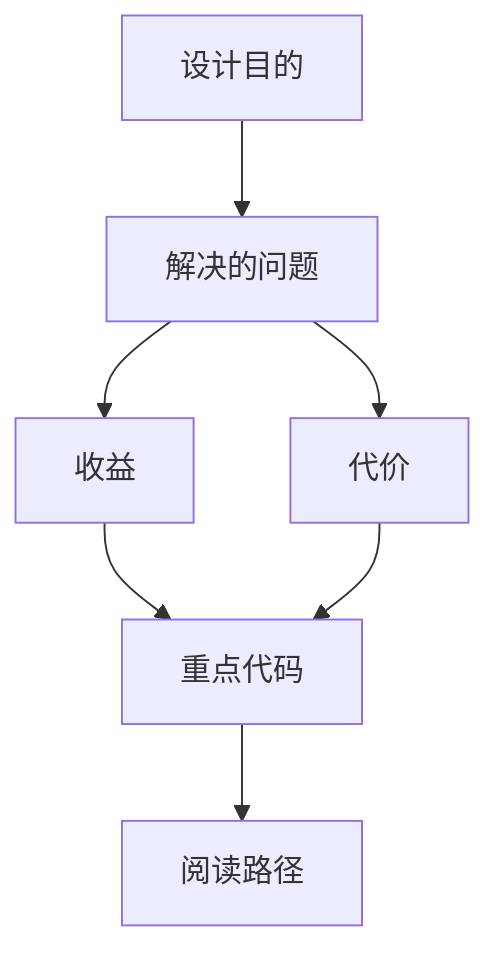

<title>70｜Community Search/Fetch/Image Tools 详解</title>

<callout emoji="✅">
**本章目标：**讲清 Tavily、Firecrawl、Exa、Jina、DDG、InfoQuest、Serper 等社区工具如何接入。
</callout>

# 1. 模块职责

| 模块 | 说明 |
|-|-|
| Tavily | web_search/web_fetch，TAVILY_API_KEY。 |
| Firecrawl | web_search/web_fetch，FirecrawlApp。 |
| Exa | 搜索和抓取网页。 |
| Jina AI | 异步 web_fetch，支持 proxy/timeout。 |
| DDG Search | 文本搜索，区域和 Wikipedia 后端推断。 |
| InfoQuest | search/fetch/image_search。 |
| Serper | Google Serper search。 |

# 2. 运行逻辑图

---

# 补充：设计取舍、重点代码与阅读路径

<callout emoji="💡">
**设计目的：**该模块承担 agent 扩展能力，是为了把工具、知识、长期上下文或执行环境做成可组合部件。
</callout>

| 维度 | 说明 |
|-|-|
| 收益 | 收益是可扩展、可配置、可替换。 |
| 代价 | 代价是配置、prompt、工具 schema、外部服务任一环节出错都会影响结果。 |
| 重点代码 | 重点代码在 `backend/packages/harness/deerflow` 下对应 skills/mcp/memory/sandbox/tools/models 模块。 |
| 阅读路径 | 阅读路径：明确它给 agent 增加了什么能力，以及该能力在哪里被注入。 |

