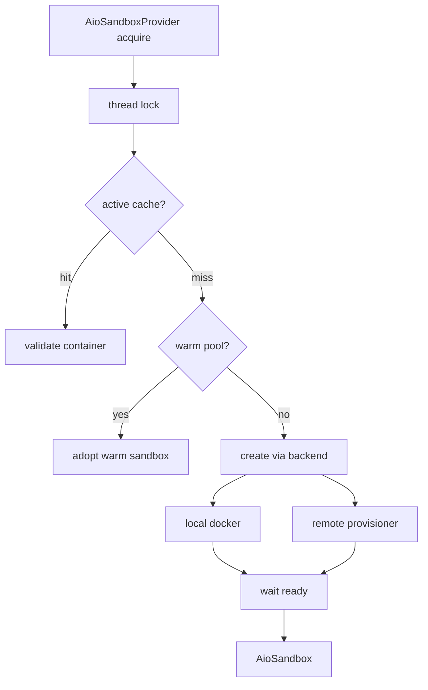
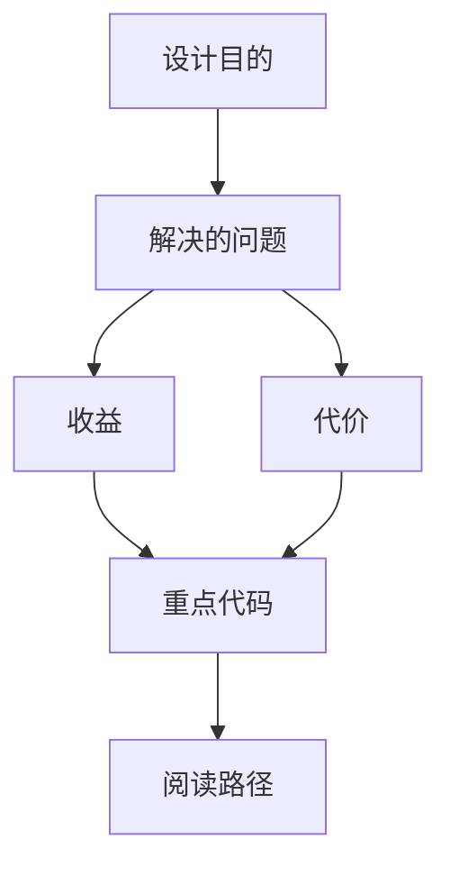

<title>71｜AioSandbox Community Backend 详解</title>

<callout emoji="✅">
**本章目标：**深入容器化 sandbox backend、local docker backend、remote provisioner backend。
</callout>

# 1. 模块职责

| 模块 | 说明 |
|-|-|
| `aio_sandbox_provider.py` | Provider 缓存、warm pool、thread lock、acquire/release。 |
| `aio_sandbox.py` | AioSandbox 实现 execute/read/write/list。 |
| `local_backend.py` | Docker container 创建、端口、mount、健康检查。 |
| `remote_backend.py` | 通过 provisioner 远程创建 sandbox。 |
| `backend.py` | 抽象 backend 和 readiness polling。 |

# 2. 运行逻辑图

---

# 补充：设计取舍、重点代码与阅读路径

<callout emoji="💡">
**设计目的：**前端按 route、core 数据层、业务组件、UI primitive 分层，是为了降低组件耦合。
</callout>

| 维度 | 说明 |
|-|-|
| 收益 | 收益是展示层和数据请求分离，组件更容易复用。 |
| 代价 | 代价是一次用户交互常跨页面、hook、缓存、上下文和组件。 |
| 重点代码 | 重点代码在 `frontend/src/app`、`frontend/src/core`、`frontend/src/components` 对应模块。 |
| 阅读路径 | 阅读路径：先找 route，再找 hook 数据源，最后看组件消费。 |

