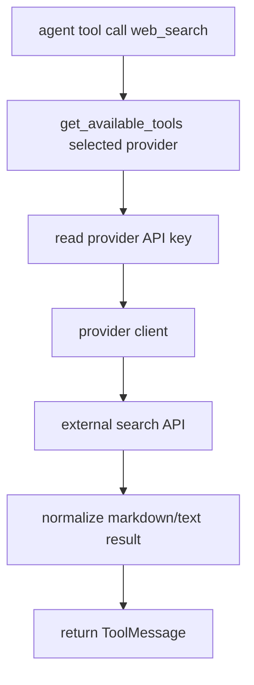
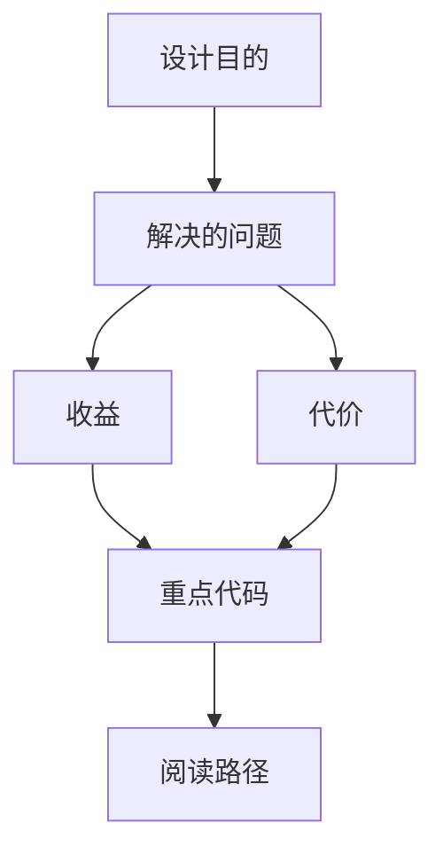

<title>78｜Tavily、Firecrawl、Exa、Serper Web Search Provider 详解</title>

<callout emoji="✅">
**本章目标：**单独讲清各 web_search/web_fetch provider 的接入方式。
</callout>

| 模块点 | 说明 |
|-|-|
| Tavily | TavilyClient，web_search 和 web_fetch。 |
| Firecrawl | FirecrawlApp，搜索和页面抓取。 |
| Exa | Exa SDK，搜索结果和页面内容。 |
| Serper | Google Serper API，max_results。 |
| 接入点 | 配置工具组后进入 get_available_tools。 |

---

# 补充：设计取舍、重点代码与阅读路径

<callout emoji="💡">
**设计目的：**该模块承担 agent 扩展能力，是为了把工具、知识、长期上下文或执行环境做成可组合部件。
</callout>

| 维度 | 说明 |
|-|-|
| 收益 | 收益是可扩展、可配置、可替换。 |
| 代价 | 代价是配置、prompt、工具 schema、外部服务任一环节出错都会影响结果。 |
| 重点代码 | 重点代码在 `backend/packages/harness/deerflow` 下对应 skills/mcp/memory/sandbox/tools/models 模块。 |
| 阅读路径 | 阅读路径：明确它给 agent 增加了什么能力，以及该能力在哪里被注入。 |

