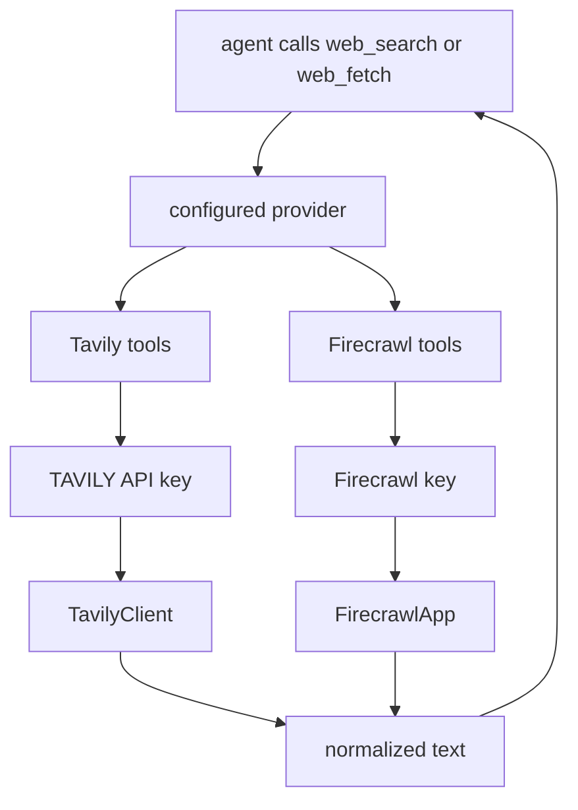
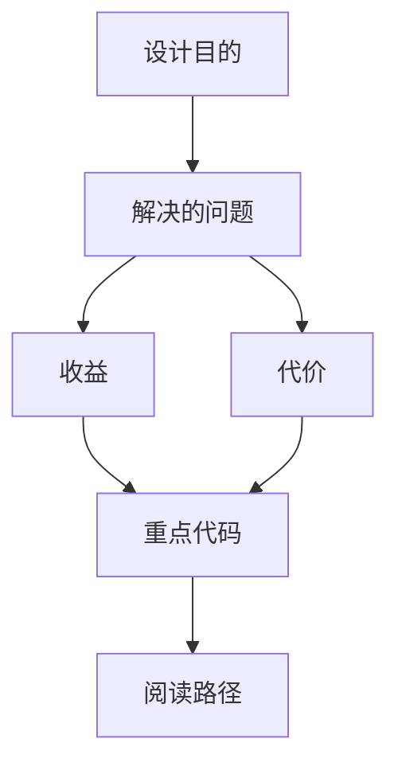

<title>82｜Tavily 与 Firecrawl Provider 单模块详解</title>

<callout emoji="✅">
**本章目标：**细化两个常用 web_search/web_fetch provider 的运行逻辑。
</callout>

| 模块点 | 说明 |
|-|-|
| Tavily | `_get_tavily_client` 读取 key，web_search/web_fetch 返回文本结果。 |
| Firecrawl | `FirecrawlApp` 创建 client，search/fetch 页面内容。 |
| 共同点 | 都是 community tool module，最终作为 BaseTool 进入 agent。 |
| 差异 | Firecrawl 更偏网页抓取，Tavily 更偏搜索 API。 |

---

# 补充：设计取舍、重点代码与阅读路径

<callout emoji="💡">
**设计目的：**该模块承担 agent 扩展能力，是为了把工具、知识、长期上下文或执行环境做成可组合部件。
</callout>

| 维度 | 说明 |
|-|-|
| 收益 | 收益是可扩展、可配置、可替换。 |
| 代价 | 代价是配置、prompt、工具 schema、外部服务任一环节出错都会影响结果。 |
| 重点代码 | 重点代码在 `backend/packages/harness/deerflow` 下对应 skills/mcp/memory/sandbox/tools/models 模块。 |
| 阅读路径 | 阅读路径：明确它给 agent 增加了什么能力，以及该能力在哪里被注入。 |

