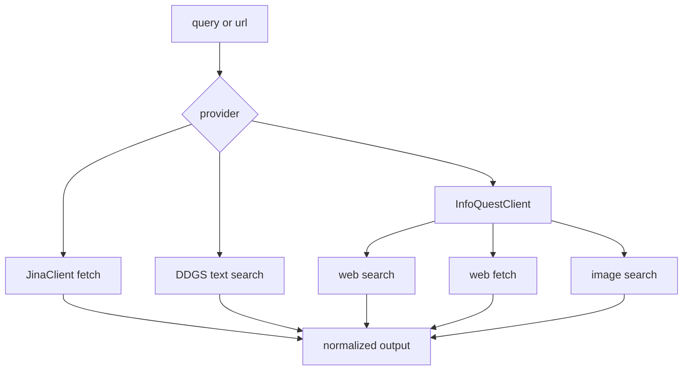
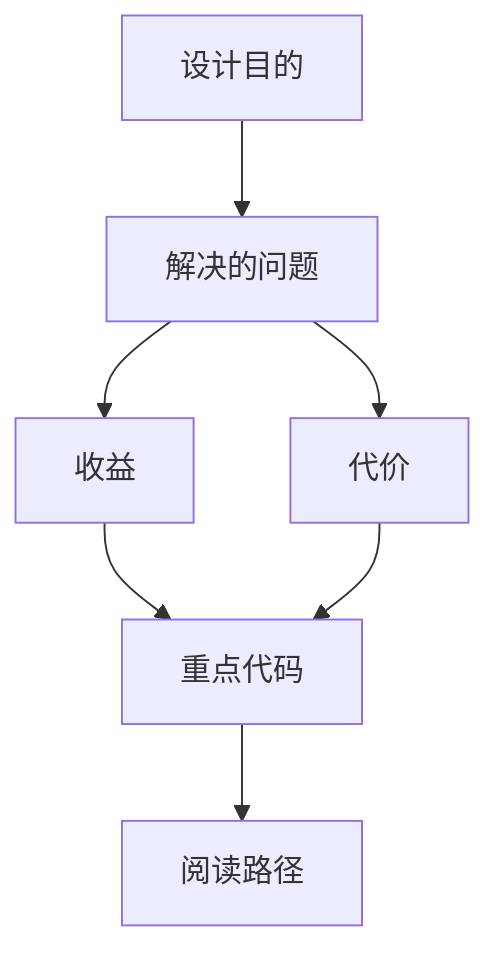

<title>84｜Jina、DDG、InfoQuest Provider 单模块详解</title>

<callout emoji="✅">
**本章目标：**细化 Jina fetch、DDG search、InfoQuest 多能力 provider。
</callout>

| 模块点 | 说明 |
|-|-|
| Jina | 异步 web_fetch，支持 timeout/proxy 参数清洗。 |
| DDG | DuckDuckGo 文本搜索，自动推断 region 和 Wikipedia 后端。 |
| InfoQuest | web_search/web_fetch/image_search 三合一。 |
| Image Search | 图片搜索结果用于多媒体任务。 |

---

# 补充：设计取舍、重点代码与阅读路径

<callout emoji="💡">
**设计目的：**该模块单独成章，是为了把职责边界、运行逻辑和维护入口从大系统中抽出来。
</callout>

| 维度 | 说明 |
|-|-|
| 收益 | 收益是学习和定位更聚焦。 |
| 代价 | 代价是章节数量更多，需要依赖目录维护。 |
| 重点代码 | 重点代码见本章列出的文件路径。 |
| 阅读路径 | 阅读路径：先看上游输入和下游输出，再读关键函数。 |

