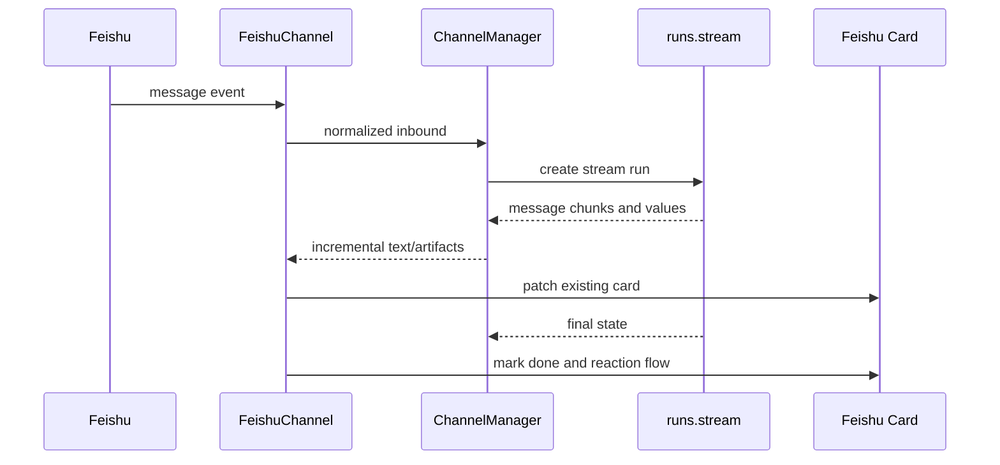
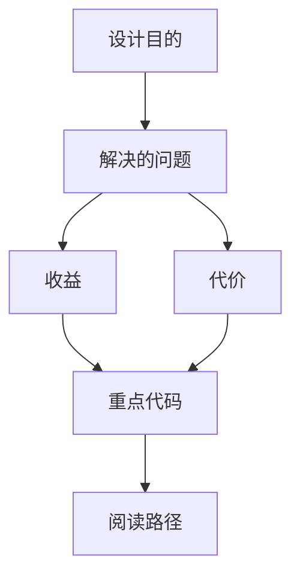

<title>85｜Feishu Channel 深入运行逻辑</title>

<callout emoji="✅">
**本章目标：**进一步细化 Feishu channel 的卡片更新、reaction 和 thread 映射。
</callout>

| 模块点 | 说明 |
|-|-|
| 入口 | Feishu event -> FeishuChannel -> ChannelManager。 |
| 命令 | 识别内置命令和 slash skill。 |
| 运行 | Feishu 采用 runs.stream，边生成边更新卡片。 |
| 状态 | 保存 running card message_id，直到 run 完成。 |
| 交互 | OK/DONE reaction 流程保持。 |

---

# 补充：设计取舍、重点代码与阅读路径

<callout emoji="💡">
**设计目的：**该模块单独成章，是为了把职责边界、运行逻辑和维护入口从大系统中抽出来。
</callout>

| 维度 | 说明 |
|-|-|
| 收益 | 收益是学习和定位更聚焦。 |
| 代价 | 代价是章节数量更多，需要依赖目录维护。 |
| 重点代码 | 重点代码见本章列出的文件路径。 |
| 阅读路径 | 阅读路径：先看上游输入和下游输出，再读关键函数。 |

