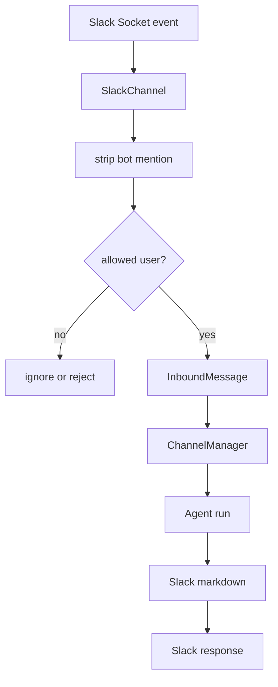
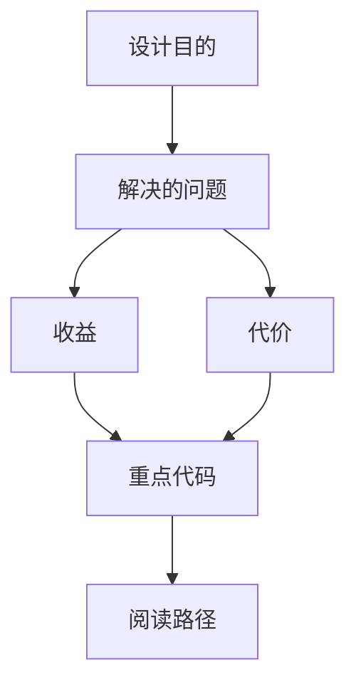

<title>86｜Slack Channel 深入运行逻辑</title>

<callout emoji="✅">
**本章目标：**进一步细化 Slack Socket Mode、mention 剥离、allowed users 和回复逻辑。
</callout>

| 模块点 | 说明 |
|-|-|
| Socket Mode | 通过 Slack SDK 接收事件。 |
| mention 处理 | 剥离 leading bot mention。 |
| allowed users | 限制可调用用户集合。 |
| 消息归一 | 转为 InboundMessage。 |
| 输出 | 把 agent 最终响应发送回 Slack。 |

---

# 补充：设计取舍、重点代码与阅读路径

<callout emoji="💡">
**设计目的：**该模块单独成章，是为了把职责边界、运行逻辑和维护入口从大系统中抽出来。
</callout>

| 维度 | 说明 |
|-|-|
| 收益 | 收益是学习和定位更聚焦。 |
| 代价 | 代价是章节数量更多，需要依赖目录维护。 |
| 重点代码 | 重点代码见本章列出的文件路径。 |
| 阅读路径 | 阅读路径：先看上游输入和下游输出，再读关键函数。 |

