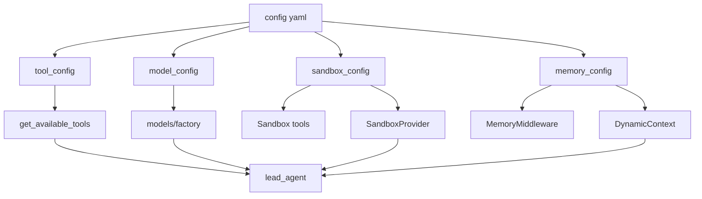
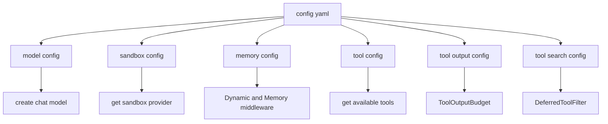
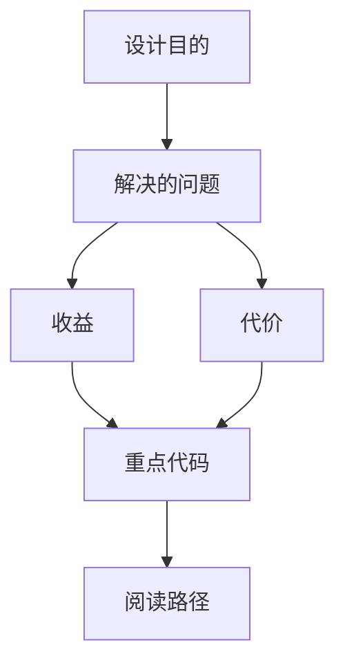

<title>88｜Model/Sandbox/Memory/Tool Config 单文件详解</title>

<callout emoji="✅">
**本章目标：**把常用配置文件进一步单独说明。
</callout>

---

# 可视化增强：配置传播总览

<callout emoji="💡">
**图解目标：**在已有配置流图基础上补一张按运行消费者分类的图，突出哪些配置影响模型、执行环境和上下文。
</callout>

## 1. 配置到消费者映射图

| 读图对象 | 图里怎么看 | 维护入口 |
|-|-|-|
| 模块职责 | 集中解释常用配置如何进入运行消费者 | config/\*.py |
| 数据流 | config.yaml 先变 typed config，再被 factory/middleware/tool registry 消费 | AppConfig.from_file |
| 阅读路径 | 先字段，再消费者，再运行影响 | 88 章节 |

| 模块点 | 说明 |
|-|-|
| model_config.py | 模型名称、provider class path、API 参数、能力开关。 |
| sandbox_config.py | provider use、mounts、host bash。 |
| memory_config.py | memory enabled、storage、injection、token 计数。 |
| tool_config.py | 工具组配置。 |
| tool_output_config.py | 工具输出预算。 |
| tool_search_config.py | deferred tool search。 |

---

# 补充：设计取舍、重点代码与阅读路径

<callout emoji="💡">
**设计目的：**这些 config 文件把模型、sandbox、memory、tool 输出和 deferred search 的开关集中成 typed schema，输入来自 config.yaml/env，输出供 model factory、middleware、tool registry 和 sandbox provider 消费。
</callout>

| 维度 | 说明 |
|-|-|
| 收益 | 收益是配置变更有明确 schema 和默认值；维护者能按字段追踪到具体运行时消费者。 |
| 代价 | 代价是字段会跨 AppConfig、legacy singleton 和 middleware 三处传播；风险是热加载字段与 startup-only 字段混用。 |
| 重点代码 | 维护入口：`model_config.py`、`sandbox_config.py`、`memory_config.py`、`tool_config.py`、`tool_output_config.py`、`tool_search_config.py`，以及聚合它们的 `app_config.py`。 |
| 阅读路径 | 阅读路径：先看字段定义和默认值，再在 `AppConfig.from_file()` 中追踪加载，最后跳到 model factory、middleware 或 tool registry 看实际消费。 |

