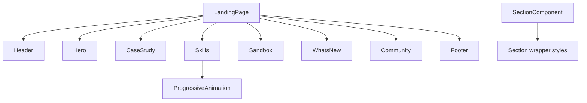
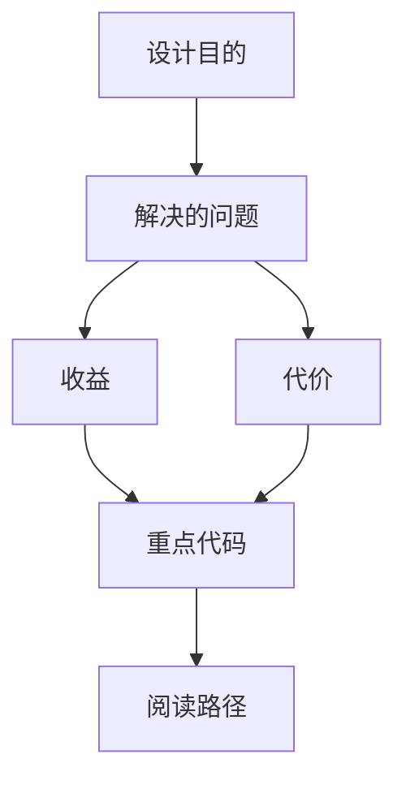

<title>89｜Landing Sections 深入组件逻辑</title>

<callout emoji="✅">
**本章目标：**进一步拆首页每个 section 的组织方式和职责。
</callout>

| 模块点 | 说明 |
|-|-|
| hero.tsx | 主视觉、品牌口号、CTA。 |
| case-study-section.tsx | 案例展示区。 |
| skills-section.tsx | skills 能力和动画展示。 |
| sandbox-section.tsx | sandbox 隔离执行能力展示。 |
| whats-new-section.tsx | 版本亮点。 |
| community-section.tsx | 社区和参与入口。 |

---

# 补充：设计取舍、重点代码与阅读路径

<callout emoji="💡">
**设计目的：**Landing sections 把首页拆成 Hero、Case Study、Skills、Sandbox、WhatsNew、Community 等可组合展示块，输入是静态文案、动画组件和共享 Section wrapper，输出是官网首屏到社区入口的完整转化路径。
</callout>

| 维度 | 说明 |
|-|-|
| 收益 | 收益是营销内容可按 section 独立迭代；视觉、CTA 和产品能力展示互不阻塞。 |
| 代价 | 代价是首页体验分散在多个组件和动画里；风险是 shared layout、响应式断点或文案改动影响整体节奏。 |
| 重点代码 | 维护入口：`frontend/src/app/page.tsx`、`frontend/src/components/landing/hero.tsx`、`sections/case-study-section.tsx`、`sections/skills-section.tsx`、`sections/sandbox-section.tsx`、`sections/whats-new-section.tsx`、`sections/community-section.tsx`。 |
| 阅读路径 | 阅读路径：先看 `page.tsx` 的 section 顺序，再逐个进入 section 文件，最后回到共享 `Section`、Header/Footer 和动画组件检查样式约束。 |

