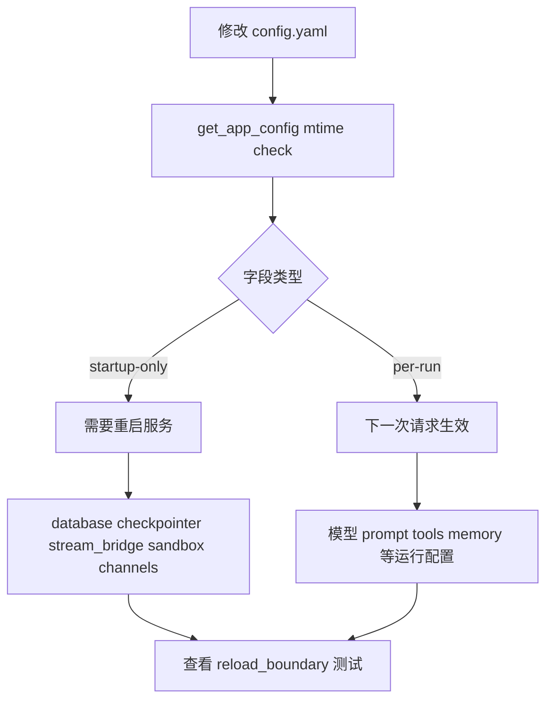
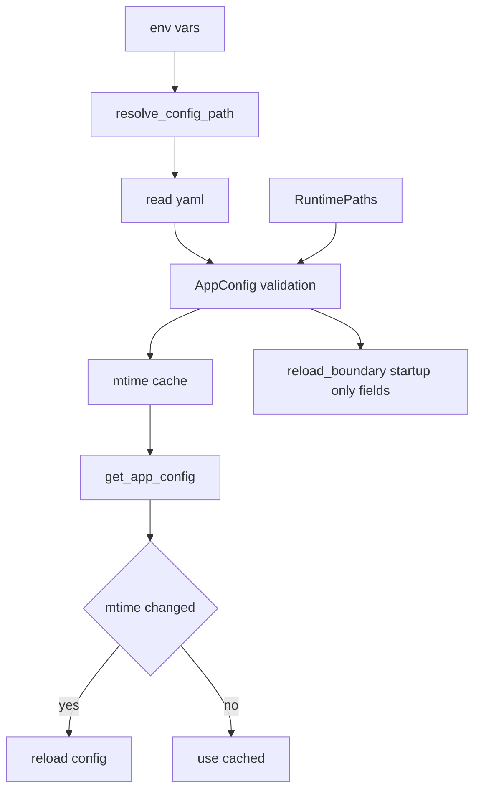
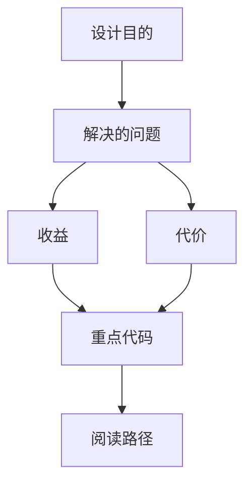

<title>90｜AppConfig、Runtime Paths、Reload Boundary 单文件详解</title>

<callout emoji="✅">
**本章目标：**把 AppConfig 聚合、runtime_paths 与 startup-only 边界单独讲清。
</callout>

---

# 可视化增强：热加载与重启边界图

<callout emoji="💡">
**图解目标：**补充 hot reload 和 startup-only 的判断路径，避免读者误以为所有配置都即时生效。
</callout>

## 1. 配置生效边界图

| 读图对象 | 图里怎么看 | 维护入口 |
|-|-|-|
| 模块职责 | AppConfig 管配置对象，reload_boundary 管生效边界 | app_config.py、reload_boundary.py |
| 数据流 | mtime 触发 reload，但基础设施字段仍需要重启 | get_app_config、lifespan |
| 阅读路径 | 先看字段是否 startup-only，再决定热加载或重启 | 90 章节 |

| 模块点 | 说明 |
|-|-|
| AppConfig | 主配置聚合、resolve_config_path、get_app_config mtime 缓存。 |
| runtime_paths | project_root、runtime_home、existing_project_file。 |
| reload_boundary | 标记 startup-only 字段，提醒用户哪些需要重启。 |
| ContextVar override | push/pop current app config 支持测试或请求上下文。 |

---

# 补充：设计取舍、重点代码与阅读路径

<callout emoji="💡">
**设计目的：**AppConfig 聚合配置文件、环境变量解析、mtime 热加载和 startup-only 边界，输入是 config path/env，输出是每次请求和 runtime 组件都能读取的统一配置对象。
</callout>

| 维度 | 说明 |
|-|-|
| 收益 | 收益是大多数 per-run 字段可在下一次请求生效；测试也可以用 ContextVar override 注入临时配置。 |
| 代价 | 代价是必须明确区分热加载字段和启动期字段；风险是 database、checkpointer、run_events、sandbox 等基础设施字段修改后未重启。 |
| 重点代码 | 维护入口：`app_config.py` 的 `from_file/get_app_config/reload_app_config`、`runtime_paths.py`、`reload_boundary.py` 和 `tests/test_reload_boundary.py`。 |
| 阅读路径 | 阅读路径：先看配置路径解析，再看 env 替换和 Pydantic 校验，最后检查 reload_boundary 是否把需要重启的字段纳入测试。 |

