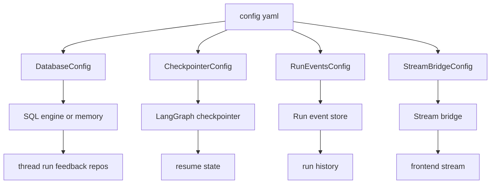
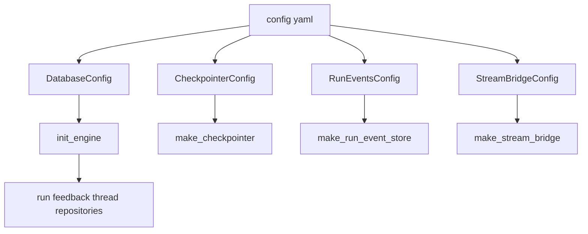
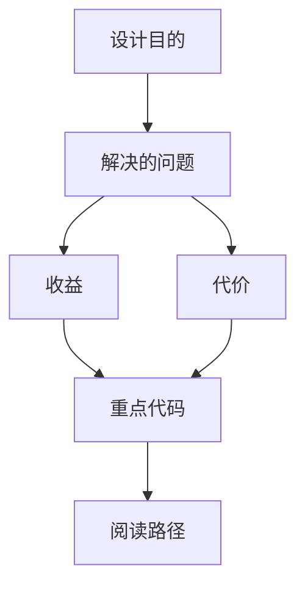

<title>91｜Database、Checkpointer、RunEvents Config 详解</title>

<callout emoji="✅">
**本章目标：**拆 database/checkpointer/run_events 相关配置。
</callout>

---

# 可视化增强：持久化后端关系图

<callout emoji="💡">
**图解目标：**补充 database、checkpointer、run events、stream bridge 的后端关系，帮助排查状态恢复与历史查询。
</callout>

## 1. 运行持久化组件关系图

| 读图对象 | 图里怎么看 | 维护入口 |
|-|-|-|
| 模块职责 | 四类配置共同决定运行状态如何保存、恢复和推送 | database_config、checkpointer_config、run_events_config |
| 数据流 | engine 支撑 repo，checkpointer 支撑图恢复，event store 支撑历史 | runtime providers |
| 阅读路径 | 按恢复问题、历史问题、SSE 问题分别看对应后端 | 91 章节 |

| 模块点 | 说明 |
|-|-|
| DatabaseConfig | 数据库 backend 和连接配置。 |
| CheckpointerConfig | LangGraph checkpoint backend 选择。 |
| RunEventsConfig | run events 存储开关和后端。 |
| StreamBridgeConfig | stream bridge backend。 |

---

# 补充：设计取舍、重点代码与阅读路径

<callout emoji="💡">
**设计目的：**database/checkpointer/run_events/stream_bridge 配置把会话持久化、checkpoint、事件存储和流桥接后端统一管理，输入是 backend 类型和连接参数，输出是 runtime 启动时创建的存储组件。
</callout>

| 维度 | 说明 |
|-|-|
| 收益 | 收益是 dev 可用 memory，单机可用 sqlite，生产可用 postgres/db 后端；运行历史、反馈和 checkpoint 能按环境切换。 |
| 代价 | 代价是这些配置多为启动期基础设施；风险是连接串、pool、checkpoint backend 或 event store backend 不一致导致恢复和查询行为分裂。 |
| 重点代码 | 维护入口：`database_config.py`、`checkpointer_config.py`、`run_events_config.py`、`stream_bridge_config.py`，以及 runtime 下的 provider factory。 |
| 阅读路径 | 阅读路径：先确认 backend 选择，再追踪 `make_checkpointer`、`make_run_event_store`、`make_stream_bridge`，最后看 repository 如何读写 run/thread/feedback 数据。 |

