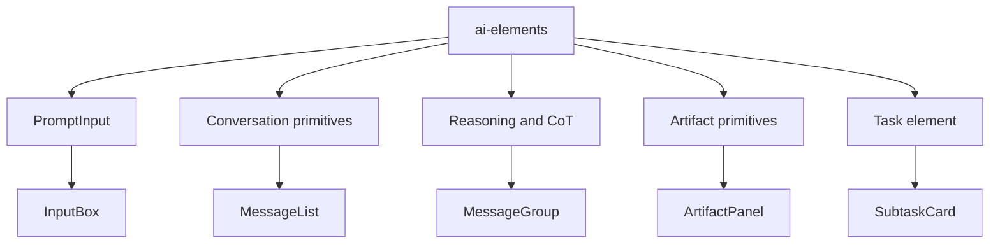
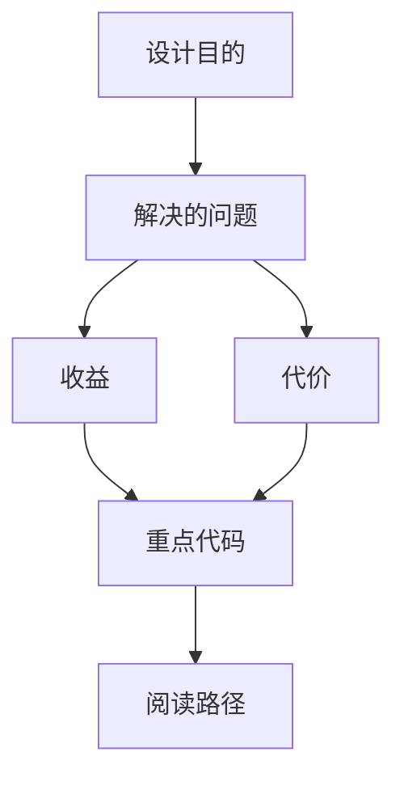

<title>94｜Frontend AI Elements Primitives 详解</title>

<callout emoji="✅">
**本章目标：**讲清 components/ai-elements 对聊天消息、prompt、artifact、reasoning 的支撑。
</callout>

| 模块点 | 说明 |
|-|-|
| prompt-input | 输入框、footer、submit、textarea。 |
| conversation/message | 会话容器和基础消息布局。 |
| reasoning/chain-of-thought | reasoning 和工具过程展示。 |
| artifact/canvas/image/web-preview | 产物、多媒体和网页预览。 |
| task/sources/suggestion | 任务、来源、建议问题。 |

---

# 补充：设计取舍、重点代码与阅读路径

<callout emoji="💡">
**设计目的：**该模块承担 agent 扩展能力，是为了把工具、知识、长期上下文或执行环境做成可组合部件。
</callout>

| 维度 | 说明 |
|-|-|
| 收益 | 收益是可扩展、可配置、可替换。 |
| 代价 | 代价是配置、prompt、工具 schema、外部服务任一环节出错都会影响结果。 |
| 重点代码 | 重点代码在 `backend/packages/harness/deerflow` 下对应 skills/mcp/memory/sandbox/tools/models 模块。 |
| 阅读路径 | 阅读路径：明确它给 agent 增加了什么能力，以及该能力在哪里被注入。 |

