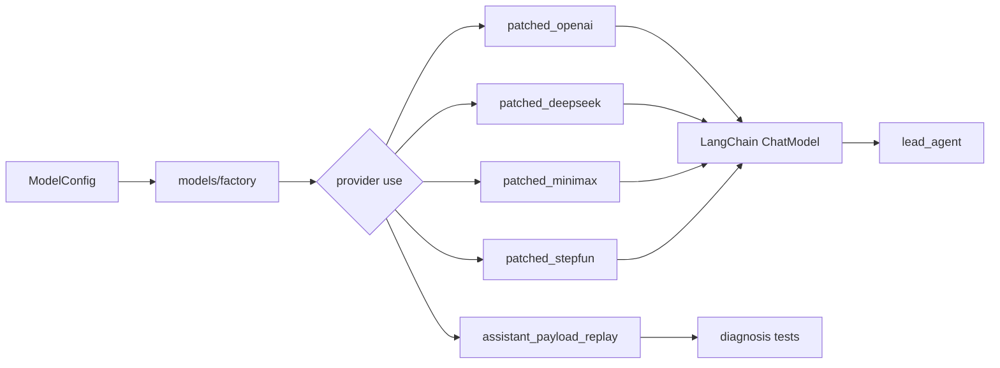
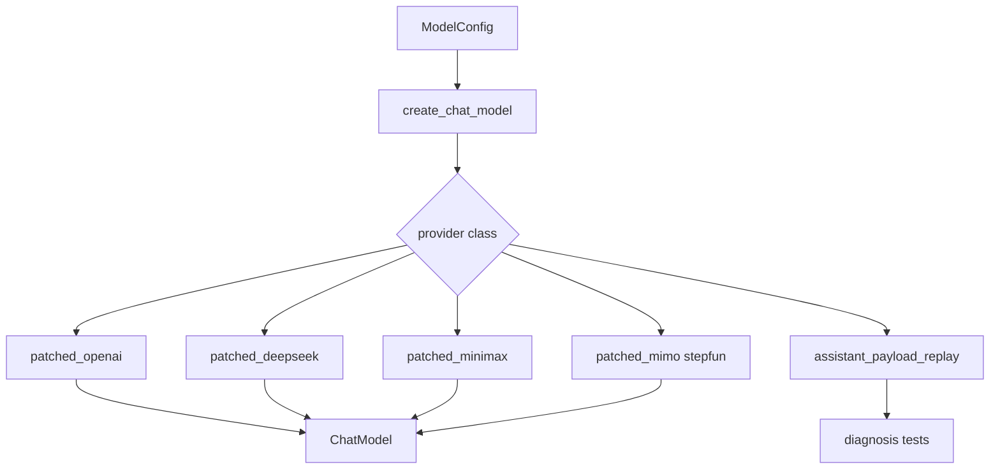
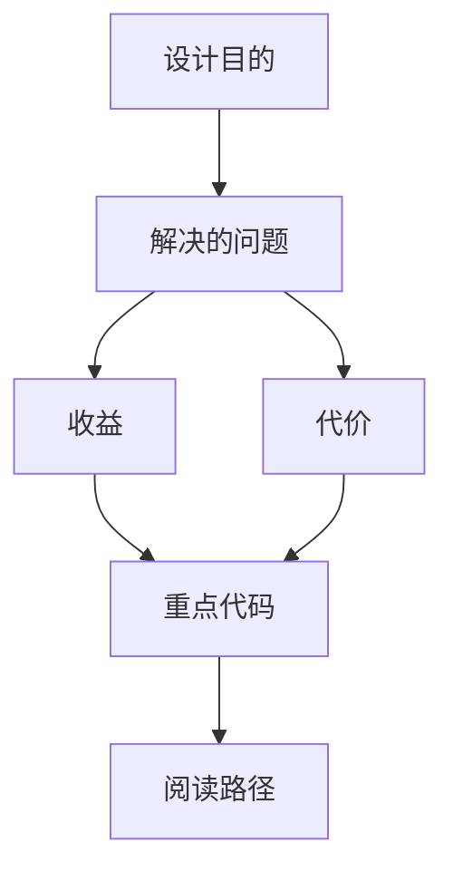

<title>95｜Patched Model Providers 深入详解</title>

<callout emoji="✅">
**本章目标：**继续拆 patched providers，说明不同模型兼容处理的必要性。
</callout>

---

# 可视化增强：模型适配数据流

<callout emoji="💡">
**图解目标：**补充模型 provider 适配从配置到标准 ChatModel 输出的图，突出 reasoning、tool call、payload replay。
</callout>

## 1. Provider 适配数据流

| 读图对象 | 图里怎么看 | 维护入口 |
|-|-|-|
| 模块职责 | 把不同供应商协议差异收敛成统一 ChatModel | models/patched\_\*.py |
| 数据流 | ModelConfig 选 provider，provider 处理参数、reasoning、tool call | models/factory.py |
| 阅读路径 | 先 factory，再具体 patched，再 replay 测试 | 95 章节 |

| 模块点 | 说明 |
|-|-|
| patched_openai | OpenAI 兼容 API 参数、responses API 等适配。 |
| patched_deepseek | DeepSeek 特殊输出或参数兼容。 |
| patched_minimax | MiniMax think block/reasoning 兼容。 |
| patched_mimo/stepfun | 其他 provider 兼容层。 |
| assistant_payload_replay | 回放模型 payload 用于测试/诊断。 |

---

# 补充：设计取舍、重点代码与阅读路径

<callout emoji="💡">
**设计目的：**patched model providers 把 OpenAI 兼容协议、DeepSeek reasoning、MiniMax think block、StepFun/Mimo 差异统一收敛到 ChatModel 接口，避免每个调用点都写 provider 分支。
</callout>

| 维度 | 说明 |
|-|-|
| 收益 | 收益是模型工厂只需要选择 provider class，运行时可复用统一的流式输出、tool call、reasoning_content 和 payload replay 诊断路径。 |
| 代价 | 代价是每个供应商升级协议时都可能破坏补丁层；风险集中在非标准字段丢失、流式 chunk 合并错误、历史 assistant payload 回放不一致。 |
| 重点代码 | 输入是 `ModelConfig.use/model/use_responses_api/thinking` 与供应商响应 payload；输出是可被 lead agent 直接消费的 LangChain chat model。维护入口：`backend/packages/harness/deerflow/models/patched_openai.py`、`patched_deepseek.py`、`patched_minimax.py`、`patched_stepfun.py`、`assistant_payload_replay.py`。 |
| 阅读路径 | 阅读路径：先从 `models/factory.py` 看 provider class 如何实例化，再进入具体 patched 文件检查参数注入、reasoning 提取、streaming chunk 和 replay 测试。 |

