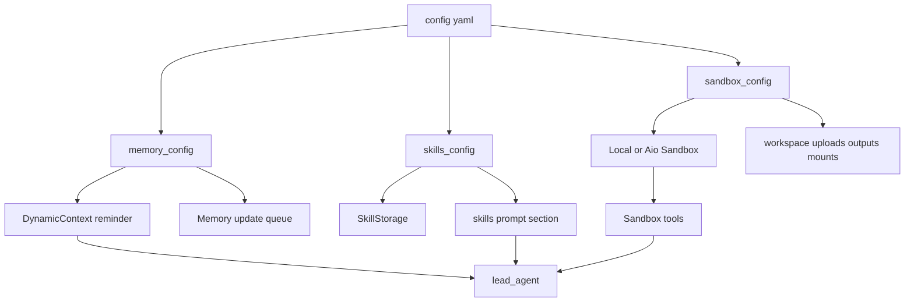
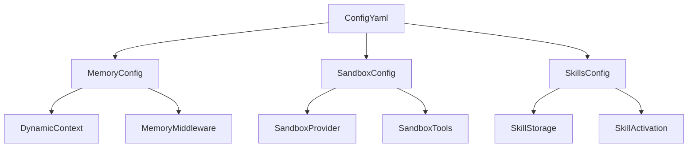
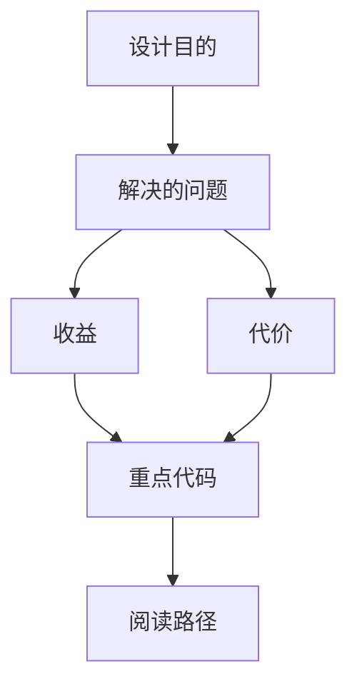

<title>98｜memory_config、sandbox_config、skills_config 单文件详解</title>

<callout emoji="✅">
**本章目标：**单独讲解该模块职责、输入输出和运行逻辑。
</callout>

---

# 可视化增强：三类能力配置图

<callout emoji="💡">
**图解目标：**补充 memory/sandbox/skills 三类配置如何分别影响上下文、执行和能力注入。
</callout>

## 1. 能力配置三分图

| 读图对象 | 图里怎么看 | 维护入口 |
|-|-|-|
| 模块职责 | Memory 管长期上下文，Sandbox 管隔离执行，Skills 管方法注入 | memory_config、sandbox_config、skills_config |
| 数据流 | 三类配置分别进入 middleware、provider、prompt/storage | agents/memory、sandbox、skills/storage |
| 阅读路径 | 按上下文、执行环境、技能注入三条线读 | 98 章节 |

| 模块点 | 说明 |
|-|-|
| memory_config | memory 开关、注入、存储路径、token 计数。 |
| sandbox_config | sandbox provider、mounts、allow_host_bash。 |
| skills_config | skills path、container_path、候选路径。 |
| 运行影响 | 分别影响 Dynamic/Memory middleware、SandboxProvider、SkillStorage。 |

---

# 补充：设计取舍、重点代码与阅读路径

<callout emoji="💡">
**设计目的：**memory、sandbox、skills 三组配置分别控制长期上下文、执行隔离和能力注入，输入来自配置文件和项目路径，输出到 Dynamic/Memory middleware、SandboxProvider、SkillStorage 与 SkillActivation。
</callout>

| 维度 | 说明 |
|-|-|
| 收益 | 收益是上下文、执行环境和技能目录可以独立开关与迁移；agent 能在不同部署形态下保持同一能力模型。 |
| 代价 | 代价是路径、挂载和 token 预算互相影响；风险是 skills 路径解析错误、sandbox mount 不一致或 memory 注入过多挤占上下文。 |
| 重点代码 | 维护入口：`memory_config.py`、`sandbox_config.py`、`skills_config.py`、`agents/memory/*`、`sandbox/*`、`skills/storage/*`。 |
| 阅读路径 | 阅读路径：先看配置字段，再追踪对应 provider 或 middleware 初始化，最后用运行时日志确认 memory、sandbox、skills 三条链路是否都被正确消费。 |

