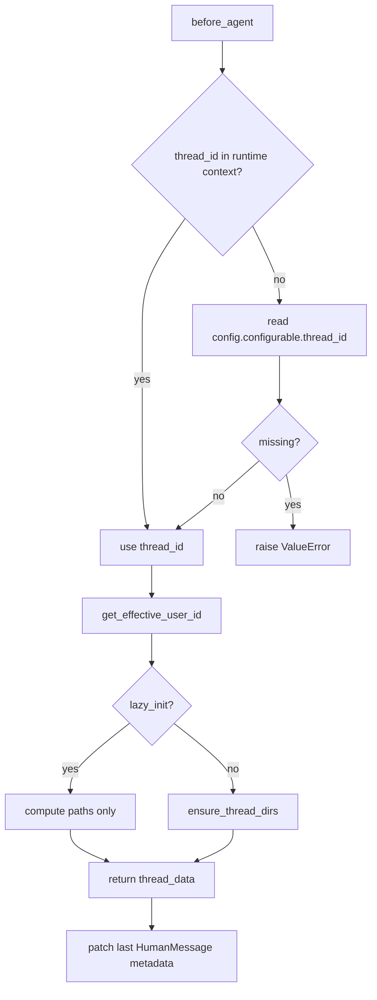
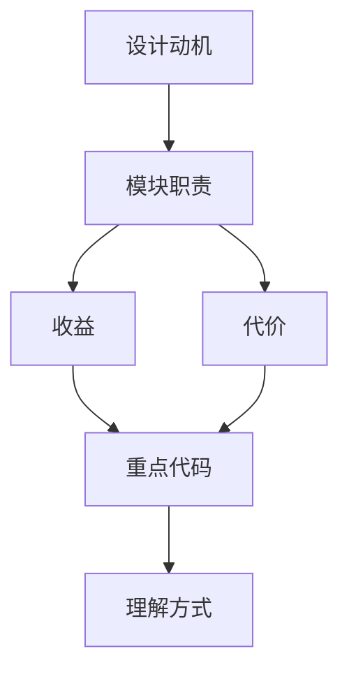

<title>24｜ThreadDataMiddleware 单文件详解</title>

<callout emoji="✅">
**本章目标：**单独讲清 ThreadDataMiddleware 如何解析 thread_id/user_id，如何创建并写入 thread_data。
</callout>

## 本轮源码校准补充：ThreadDataMiddleware

<callout emoji="💡">
**作用：**为每个 thread 准备隔离的 user-data 目录结构，让 uploads、workspace、outputs 可以被 sandbox 和工具用统一虚拟路径访问。
</callout>

| 读源码重点 | 说明 |
|-|-|
| thread id | 线程 ID 是目录隔离的核心键。 |
| virtual path | 前端/agent 看到的是 `/mnt/user-data/...` 这类虚拟路径，后端负责映射到实际目录。 |
| 后续依赖 | UploadsMiddleware、SandboxMiddleware、artifact router 都依赖同一套路径约定。 |

| 点 | 说明 |
|-|-|
| 入口 | `before_agent` |
| 状态 | 写入 `thread_data.workspace_path/uploads_path/outputs_path` |
| 隔离 | 使用 `get_effective_user_id()` 进入 per-user 目录 |
| 额外行为 | 给最后一条 HumanMessage 补 run_id 和 timestamp |

# 新同学阅读建议

先看 `_get_thread_paths` 和 `before_agent`，再顺着 `Paths.sandbox_*_dir` 理解物理目录。

---

# 补充：设计取舍、重点代码与阅读路径

<callout emoji="💡">
**设计目的：**这个模块采用 middleware 形态，是为了把横切能力从主 agent 逻辑里剥离出来，并按 LangChain/LangGraph 生命周期挂载。
</callout>

| 维度 | 说明 |
|-|-|
| 收益 | 收益是可插拔、可独立测试、能按 before/after/wrap 阶段控制行为。 |
| 代价 | 代价是执行顺序不直观，多个 middleware 同时改 messages/state 时调试成本较高。 |
| 重点代码 | 重点代码通常在 `backend/packages/harness/deerflow/agents/middlewares/`，先看 class 的 hook 方法。 |
| 阅读路径 | 阅读路径：先判断它在哪个 hook 生效，再看它读写 ThreadState 的哪些字段。 |

