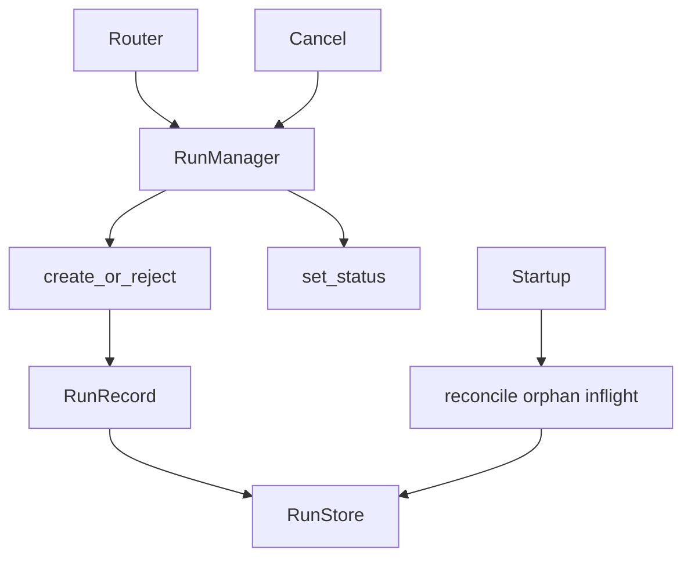
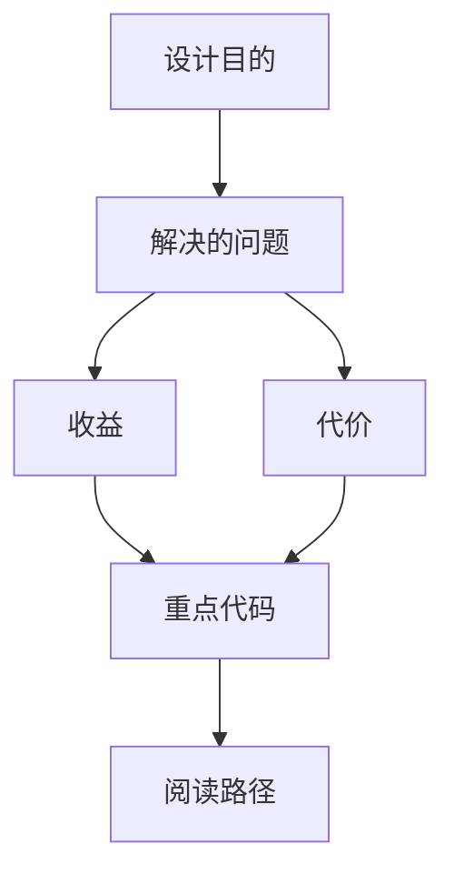

<title>266｜runtime/runs/manager.py 单文件详解</title>

<callout emoji="✅">
**本章目标：**继续拆 runtime、subagents、tools builtins 单文件模块。
</callout>

## 本轮源码校准补充：RunManager 状态机

| 功能 | 说明 |
|-|-|
| create/reject | 默认并发策略是 reject，已有 active run 时返回冲突。 |
| interrupt/rollback | 可按策略中断或回滚已有 run，但 `enqueue` 当前不支持。 |
| store | 可接 RunRepository 或 MemoryRunStore，决定 run 历史是否持久化。 |
| reconcile | 启动时可恢复/清理 orphan running runs，避免服务重启后状态悬挂。 |

| 模块点 | 说明 |
|-|-|
| RunRecord | run 元数据和状态。 |
| RunManager | 创建/查询/取消 run。 |
| ConflictError | 并发策略冲突。 |
| reconcile | 启动时恢复 orphan running runs。 |
| store | 可用 RunRepository 或 MemoryRunStore。 |

---

# 补充：设计取舍、重点代码与阅读路径

<callout emoji="💡">
**设计目的：**该模块单独成章，是为了把职责边界、运行逻辑和维护入口从大系统中抽出来。
</callout>

| 维度 | 说明 |
|-|-|
| 收益 | 收益是学习和定位更聚焦。 |
| 代价 | 代价是章节数量更多，需要依赖目录维护。 |
| 重点代码 | 重点代码见本章列出的文件路径。 |
| 阅读路径 | 阅读路径：先看上游输入和下游输出，再读关键函数。 |

