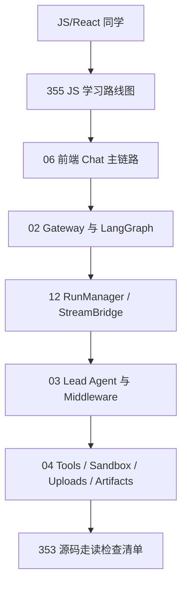
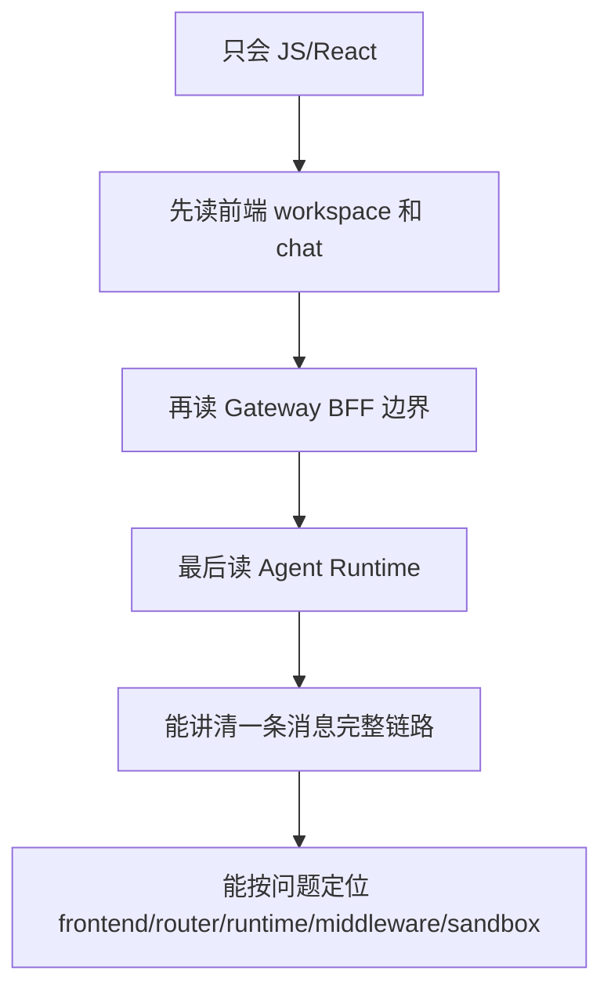
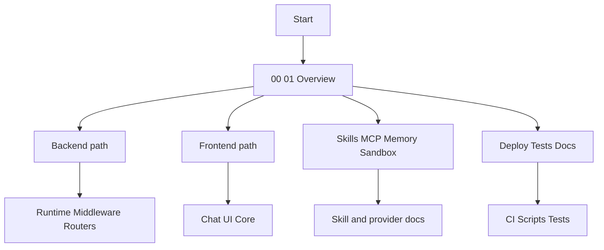
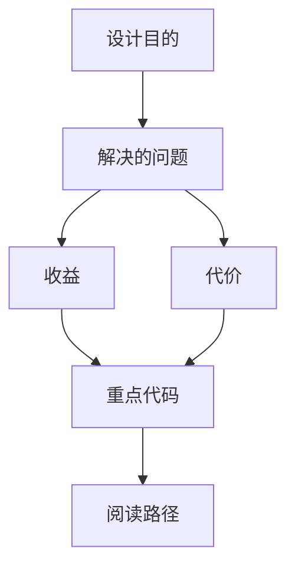

<title>349｜文档集导航指南：300+ 章节阅读路径</title>

<callout emoji="✅">
**本章目标：**为整个 DeerFlow 源码分层详解文档集提供阅读路径。
</callout>

## JS 前端学习主路径

<callout emoji="💡">
**推荐入口：**只会 JavaScript/React 的同学，先读 `355｜只会 JS 的前端学习 DeerFlow 路线图`，再沿着 06/07/02/03/12/13 深入。远端链接：https://bytedance.my.larkoffice.com/docx/Zf5Rd7lkYolmRAxm7t4m7Aotyob。
</callout>

| 阶段 | 先读文档 | 打开源码 | 学完能讲清 |
|-|-|-|-|
| 1. 前端提交链路 | 355、06、42、50 | `frontend/src/app/workspace/chats/[thread_id]/page.tsx`、`frontend/src/core/threads/hooks.ts`、`frontend/src/components/workspace/input-box.tsx` | `InputBox -> ChatPage.handleSubmit -> useThreadStream.sendMessage -> thread.submit -> MessageList`。 |
| 2. Gateway/BFF 边界 | 355、02、11、21、51 | `docker/nginx/nginx.local.conf`、`backend/app/gateway/routers/thread_runs.py`、`backend/app/gateway/services.py` | `/api/langgraph/*` 如何 rewrite 到 Gateway `/api/*`。 |
| 3. Agent Runtime | 355、03、12、13、19-36 | `backend/packages/harness/deerflow/runtime/*`、`backend/packages/harness/deerflow/agents/lead_agent/*` | `RunManager -> run_agent -> make_lead_agent -> middleware/tools -> StreamBridge`。 |
| 4. 产物/上传/配置 | 355、04、07、88、90、98 | `frontend/src/core/artifacts/*`、`backend/app/gateway/routers/uploads.py`、`backend/packages/harness/deerflow/config/*` | 上传文件、artifact panel、配置热加载和 startup-only 边界。 |

## 给只会 JavaScript 的前端同学的专门路线

<callout emoji="💡">
**推荐入口：**如果你主要会 JavaScript/React，不熟 Python 和 LangGraph，先读 `355｜只会 JS 的前端学习 DeerFlow 路线图.md`。它会先用前端/BFF/请求拦截器/插件系统的类比建立心智，再带你追一条消息从 `InputBox` 到 `lead_agent` 再回到 `MessageList` 的链路。
</callout>

| 学习阶段 | 先读章节 | 对应源码 | 验收输出 |
|-|-|-|-|
| 前端入口和聊天 UI | 06、42、50、58、100、112、129、355 | `frontend/src/app/workspace/*`、`frontend/src/components/workspace/*`、`frontend/src/core/threads/*` | 能画出 `InputBox -> ChatPage.handleSubmit -> useThreadStream.sendMessage -> thread.submit -> MessageList`。 |
| Gateway/BFF 边界 | 02、11、21、51、52、64、65、355 | `backend/app/gateway/*`、`frontend/src/core/api/*` | 能区分 `/api/langgraph/*` 与普通 `/api/*`。 |
| Agent Runtime 闭环 | 03、04、05、12、13、19-36、253-267、355 | `backend/packages/harness/deerflow/agents/*`、`runtime/*`、`sandbox/*` | 能解释 `RunManager -> lead_agent -> middleware -> tools/sandbox -> stream`。 |

| 阅读目标 | 推荐章节 |
|-|-|
| 新同学快速上手 | 00、01、02、03、06、08 |
| 后端运行时 | 02、03、11、12、21、51、52、265、266 |
| 前端聊天链路 | 06、14、42、50、58、129、300、301 |
| 扩展能力 | 05、39、40、41、70、78、79、139-166 |
| 部署测试 | 08、132-138、167-187、321-341 |

---

# 补充：设计取舍、重点代码与阅读路径

<callout emoji="💡">
**设计目的：**该模块单独成章，是为了把职责边界、运行逻辑和维护入口从大系统中抽出来。
</callout>

| 维度 | 说明 |
|-|-|
| 收益 | 收益是学习和定位更聚焦。 |
| 代价 | 代价是章节数量更多，需要依赖目录维护。 |
| 重点代码 | 重点代码见本章列出的文件路径。 |
| 阅读路径 | 阅读路径：先看上游输入和下游输出，再读关键函数。 |

