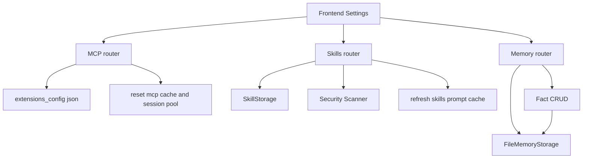
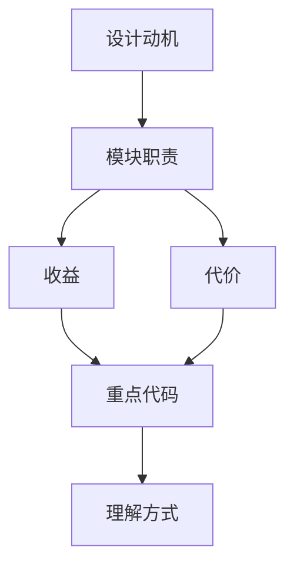

<title>49｜Gateway MCP、Skills、Memory Router 深入详解</title>

<callout emoji="✅">
**本章目标：**把三个最常被 Settings 调用的管理 router 放在一篇中深入说明。
</callout>

## 本轮源码校准补充：Gateway MCP、Skills、Memory Router

| Router | 前端入口 | 后端职责 |
|-|-|-|
| `mcp.py` | Tool settings | 管理 MCP server config、状态和工具发现。 |
| `skills.py` | Skill settings | 列出 public/custom skills，启停、安装、编辑 custom skill。 |
| `memory.py` | Memory settings | memory status、facts CRUD、import/export/reload/clear。 |

<callout emoji="💡">
这些 API 是 Settings 页的数据来源；但真正影响一次对话的是 `thread.submit` 的 context、lead_agent 装配和 middleware 注入。
</callout>

| Router | 读写对象 | 关键保护 |
|-|-|-|
| MCP | `extensions_config.json` 的 mcp_servers | mask secrets、stdio allowlist、admin required。 |
| Skills | skill storage、custom SKILL.md、extensions skill state | security scanner、history、rollback。 |
| Memory | memory.json / facts | per-user context、confidence 校验、import/export。 |

---

# 补充：设计取舍、重点代码与阅读路径

<callout emoji="💡">
**设计目的：**前端模块按页面、core hooks、组件拆分，是为了分离路由装配、数据状态和展示组件。
</callout>

| 维度 | 说明 |
|-|-|
| 收益 | 收益是组件复用和状态管理更清晰。 |
| 代价 | 代价是一次交互会跨 React Query、localStorage、useStream 和多个组件。 |
| 重点代码 | 重点代码在 `frontend/src/app`、`frontend/src/core`、`frontend/src/components/workspace`。 |
| 阅读路径 | 阅读路径：先找页面入口，再找 hook 数据源，最后看组件如何消费 props/state。 |

