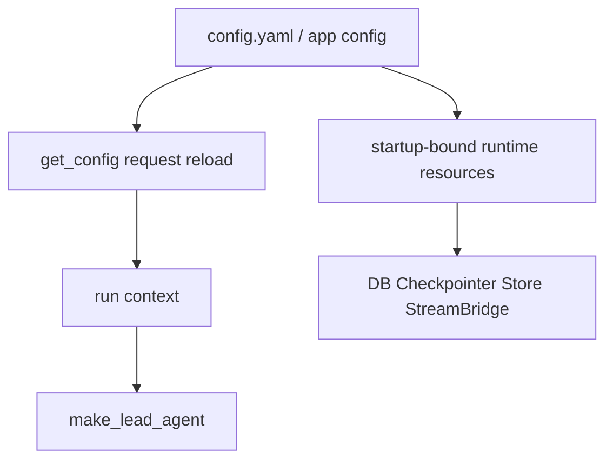
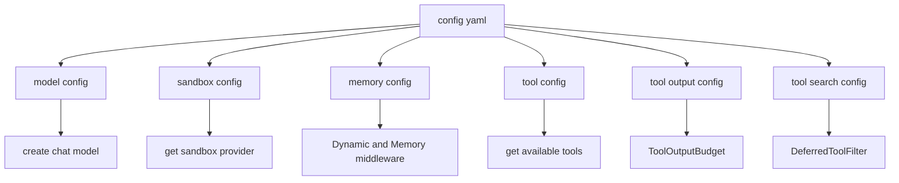
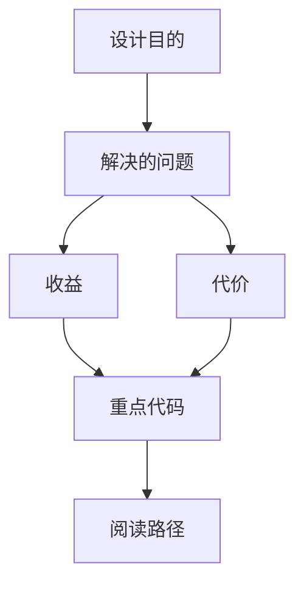

<title>88｜Model/Sandbox/Memory/Tool Config 单文件详解</title>

<callout emoji="✅">
**本章目标：**把常用配置文件进一步单独说明。
</callout>

## 本轮源码校准补充：Model/Sandbox/Memory/Tool Config

| 配置域 | 学习重点 |
|-|-|
| model config | 模型名称、provider、thinking/reasoning 能力、vision 支持会影响 `make_lead_agent`。 |
| sandbox config | provider、mounts、bash/file-write 能力决定工具可用边界。 |
| memory config | 决定 memory 是否启用、存储位置、token counting/warm-up 行为。 |
| tool config | 控制内置工具、community tools、deferred/tool search 等是否可用。 |

| 模块点 | 说明 |
|-|-|
| model_config.py | 模型名称、provider class path、API 参数、能力开关。 |
| sandbox_config.py | provider use、mounts、host bash。 |
| memory_config.py | memory enabled、storage、injection、token 计数。 |
| tool_config.py | 工具组配置。 |
| tool_output_config.py | 工具输出预算。 |
| tool_search_config.py | deferred tool search。 |

---

# 补充：设计取舍、重点代码与阅读路径

<callout emoji="💡">
**设计目的：**前端按 route、core 数据层、业务组件、UI primitive 分层，是为了降低组件耦合。
</callout>

| 维度 | 说明 |
|-|-|
| 收益 | 收益是展示层和数据请求分离，组件更容易复用。 |
| 代价 | 代价是一次用户交互常跨页面、hook、缓存、上下文和组件。 |
| 重点代码 | 重点代码在 `frontend/src/app`、`frontend/src/core`、`frontend/src/components` 对应模块。 |
| 阅读路径 | 阅读路径：先找 route，再找 hook 数据源，最后看组件消费。 |

