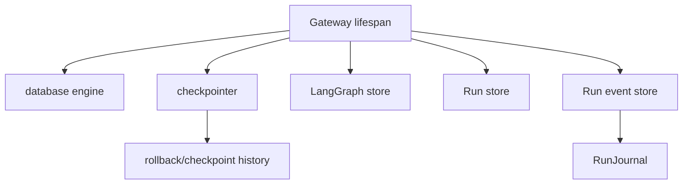
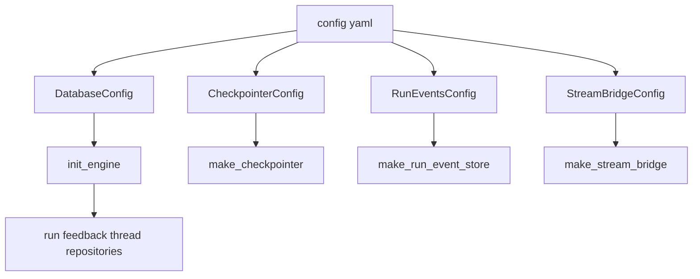
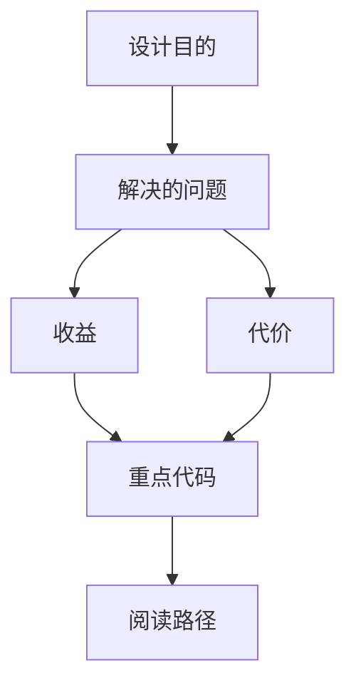

<title>91｜Database、Checkpointer、RunEvents Config 详解</title>

<callout emoji="✅">
**本章目标：**拆 database/checkpointer/run_events 相关配置。
</callout>

## 本轮源码校准补充：Database、Checkpointer、RunEvents Config

| 配置 | 影响 |
|-|-|
| database | 持久化 run/thread/feedback/user 等数据的基础连接。 |
| checkpointer | LangGraph checkpoint、history、rollback 的基础。 |
| run events | run journal、message history、token/progress 记录。 |
| startup 边界 | 这些资源多在 lifespan 初始化；修改配置后通常需要重启 Gateway。 |

| 模块点 | 说明 |
|-|-|
| DatabaseConfig | 数据库 backend 和连接配置。 |
| CheckpointerConfig | LangGraph checkpoint backend 选择。 |
| RunEventsConfig | run events 存储开关和后端。 |
| StreamBridgeConfig | stream bridge backend。 |

---

# 补充：设计取舍、重点代码与阅读路径

<callout emoji="💡">
**设计目的：**该模块单独成章，是为了把职责边界、运行逻辑和维护入口从大系统中抽出来。
</callout>

| 维度 | 说明 |
|-|-|
| 收益 | 收益是学习和定位更聚焦。 |
| 代价 | 代价是章节数量更多，需要依赖目录维护。 |
| 重点代码 | 重点代码见本章列出的文件路径。 |
| 阅读路径 | 阅读路径：先看上游输入和下游输出，再读关键函数。 |

