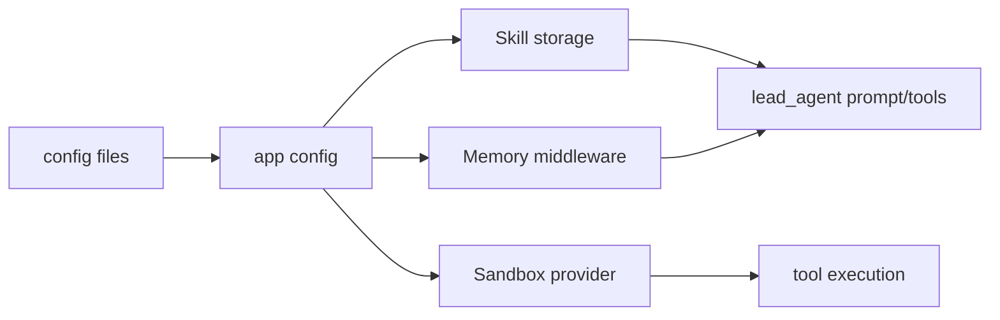
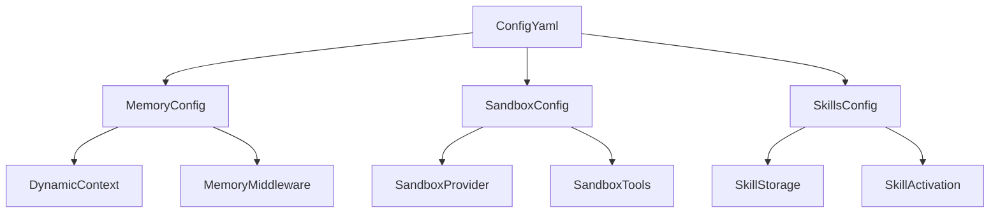
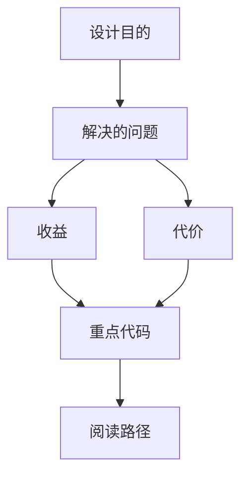

<title>98｜memory_config、sandbox_config、skills_config 单文件详解</title>

<callout emoji="✅">
**本章目标：**单独讲解该模块职责、输入输出和运行逻辑。
</callout>

## 本轮源码校准补充：memory_config、sandbox_config、skills_config

| 文件 | 学习重点 |
|-|-|
| `memory_config.py` | memory 开关、存储、token counting、用户/agent 作用域。 |
| `sandbox_config.py` | provider、路径挂载、bash/file-write、安全边界。 |
| `skills_config.py` | public/custom skill 路径、启停、解析和 prompt 注入。 |

| 模块点 | 说明 |
|-|-|
| memory_config | memory 开关、注入、存储路径、token 计数。 |
| sandbox_config | sandbox provider、mounts、allow_host_bash。 |
| skills_config | skills path、container_path、候选路径。 |
| 运行影响 | 分别影响 Dynamic/Memory middleware、SandboxProvider、SkillStorage。 |

---

# 补充：设计取舍、重点代码与阅读路径

<callout emoji="💡">
**设计目的：**该模块单独成章，是为了把职责边界、运行逻辑和维护入口从大系统中抽出来。
</callout>

| 维度 | 说明 |
|-|-|
| 收益 | 收益是学习和定位更聚焦。 |
| 代价 | 代价是章节数量更多，需要依赖目录维护。 |
| 重点代码 | 重点代码见本章列出的文件路径。 |
| 阅读路径 | 阅读路径：先看上游输入和下游输出，再读关键函数。 |

