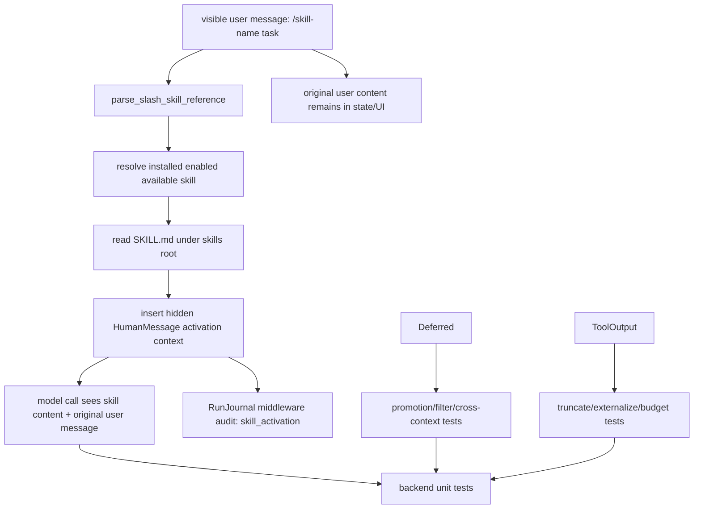
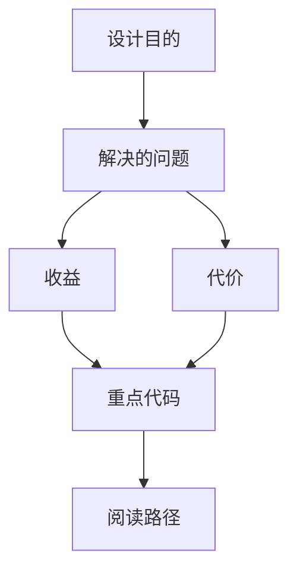

<title>184｜Skills / Tools / Deferred Tests 详解</title>

<callout emoji="✅">
**本章目标：**继续拆测试/workflow/script 单文件族，说明覆盖目标和运行逻辑。
</callout>

| 模块点 | 说明 |
|-|-|
| test_skills\_\* | skills parser/installer/loader/custom router。 |
| test_skill_manage_tool.py | skill_manage_tool。 |
| test_tool_search.py | tool search。 |
| test_deferred\_\* | deferred tools promotion/filter。 |
| test_tool_output\_\* | 工具输出截断/预算。 |

---

# 补充：设计取舍、重点代码与阅读路径

<callout emoji="💡">
**设计目的：**该模块承担 agent 扩展能力，是为了把工具、知识、长期上下文或执行环境做成可组合部件。
</callout>

| 维度 | 说明 |
|-|-|
| 收益 | 收益是可扩展、可配置、可替换。 |
| 代价 | 代价是配置、prompt、工具 schema、外部服务任一环节出错都会影响结果。 |
| 重点代码 | `backend/tests/test_slash_skills.py`、`backend/packages/harness/deerflow/agents/middlewares/skill_activation_middleware.py`、`backend/packages/harness/deerflow/tools/`、`backend/packages/harness/deerflow/mcp/`。 |
| 阅读路径 | 阅读路径：明确它给 agent 增加了什么能力，以及该能力在哪里被注入。 |

