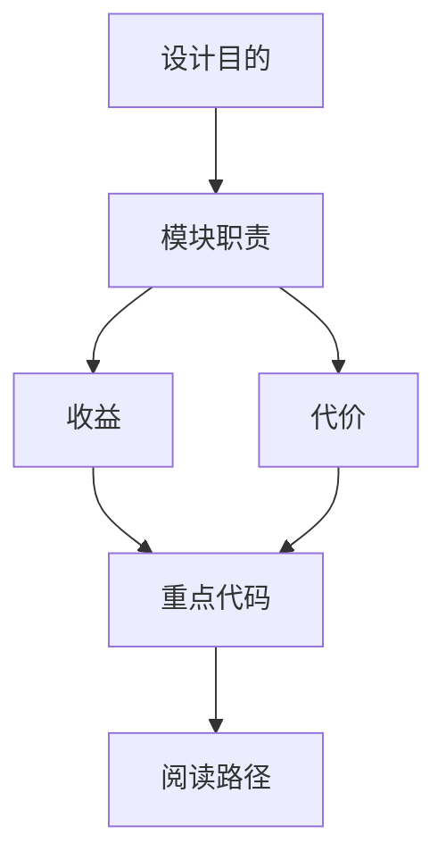

# 计划：把 10 篇 DeerFlow 文档末尾的"假示意 mermaid"替换为源码级真实图

## 问题

`.agent_context/` 下 10 篇文档（`01`～`10`，对应 `mermaid_fake_batch_001.json`）每篇末尾都贴了一个**通用模板** mermaid：

这个图和具体文档/代码**没有任何对应关系**，只是个占位示意。每篇文档前面的 mermaid 是真实图，只有这最后一个末尾图是假的。需要按每篇文档的"重点代码"指向的真实源码，改成对应的运行逻辑图。

**本地 6 个目录**都存有这 10 篇的副本（同一份内容的快照），末尾假图**字节完全相同**（已校验 MD5 一致）：
- `.agent_context/final_review/docs_md` ← 规范目录（sync_ledger 引用它）
- `.agent_context/final_review2/docs_md`
- `.agent_context/reviewer_tmp/docs_md`
- `.agent_context/visual_review/docs_md`
- `.agent_context/lark_remote/current/docs_md`
- `.agent_context/lark_remote/docs_md`

**远程飞书**：10 篇文档都有对应 docx token（sync_ledger 有记录），远程末尾的假图是 `<whiteboard type="mermaid">` block，10 个 block_id 已全部 fetch 确认。

## 已验证的事实清单

- 本地 10 篇末尾假图内容完全一致（`fcd1be4c`）。
- 每篇文档的"重点代码"行引用的真实源码路径**全部存在**（已 `os.path.exists` 校验，10 篇全通过）。
- 远程 10 篇末尾假图 whiteboard block body 与本地一致，block_id 已拿到。
- 飞书 `lark-cli` 已认证（user 身份，scope 含 `docx:document:write_only` 等），可用。
- 风格规范（`352` 文档）：节点文字保持短句、避免特殊字符；请求链路用 sequenceDiagram / flowchart；模块依赖用 flowchart TD/LR；不要 20+ 节点大图。
- 远程替换用 `docs +update --command block_replace --block-id <id> --content '<whiteboard type="mermaid">...</whiteboard>'`，只动末尾这一个 block，安全、可逆（block_replace 后若不满意可再 fetch 新 id 重做）。

## 映射表（已存 `.agent_context/magic/batch_mapping.json`）

| # | 文档 | token | 远程 block_id | 重点代码源（已验证存在） |
|-|-|-|-|-|
|01|DeerFlow 整体架构与分层总览|TFY8df1x5o53mixHM3gmqNqlyce|doxcnsJFVLjdQlbggdKXteM1MCg|nginx.local.conf, gateway/app.py, lead_agent/agent.py|
|02|Gateway 与 LangGraph 运行时详解|Dcvkdjf3KopJmsxZa9QmEQPWyic|doxcnMmESGvcf2oMmCOiILGDrmf|gateway/services.py, deps.py, runtime/runs/worker.py|
|03|Lead Agent_Prompt_Tools 与 Middleware|WbumdDbSCoTmW4xIrCsmpOIaymd|doxcnvQ3nlLlNLeINE8Rl1p5vi9|lead_agent/agent.py, prompt.py|
|04|Tools_Sandbox_Uploads 与 Artifacts|ZOtCdVzKjoa3lAx3p92ms1eMyge|doxcnpm84NWHTgx4mhEwfDBKDdg|sandbox/tools.py, routers/uploads.py, routers/artifacts.py|
|05|Skills_MCP 与 Memory|U50Ldy2sxoHbOAxo58vmNMUiyef|doxcn7yQgzWxx8bvBjY9dFg2Idc|skills/parser.py, mcp/tools.py, agents/memory/updater.py|
|06|Frontend Workspace 与 Chat 主链路|IvEydJu3Poud6vx4mR0mThL1y4f|doxcne63YophtnGzBoEJpkFM2Le|workspace/chats/[thread_id]/page.tsx, core/threads/hooks.ts, input-box.tsx|
|07|Frontend Settings_Models_Artifacts|JFD3dRkmvoRYgHxlJD1mbEUUyeb|doxcnrkdwQShTHTuoyAAgkjDYKf|settings-dialog.tsx, artifact-file-detail.tsx, core/settings/local.ts, core/artifacts/utils.ts|
|08|配置_部署_测试与排障|XyAFdSxNooUswXxcVx8mbR7iyqg|doxcnFksAfWGFcJV4eLe9Ais4ne|Makefile, scripts/serve.sh, scripts/check.py|
|09|Auth_CSRF_权限与 IM Channels|KnQBdOROXoOE37xAKPdmljJJyHd|doxcn2mJprXtha3pxSSo3ltB4zc|auth_middleware.py, csrf_middleware.py, channels/manager.py|
|10|Models_Tracing_Persistence 与 Token Usage|RUtPdneNLoPyI0x5ksKmblLJynd|doxcnEo6qFCa9VKOHM2McjerP9e|models/factory.py, tracing/factory.py, persistence/engine.py|

## 执行方案（两阶段 workflow）

### 阶段 1：为每篇文档设计源码级 mermaid（并行，1 agent/篇）

对 10 篇文档并行起 10 个 agent，每个 agent：
1. 读该篇文档全文 + 读它"重点代码"指向的 2~4 个真实源码文件。
2. 产出**针对该文档/该代码**的 mermaid：展示真实运行流（请求链路/状态流转/模块依赖/数据流/生命周期），节点用真实模块名/函数名/路由名/组件名，**不是** 设计目的/模块职责/收益/代价 这类通用标签。
3. 遵守风格规范：节点文字短句、无特殊字符、≤15 节点、按内容选 flowchart TD/LR 或 sequenceDiagram。
4. 结构化输出：`doc` / `mermaid`(完整 fence 块) / `evidence_paths`(实际读过) / `note` / `risks`。

### 阶段 2：批量评审（1 agent）

1 个 reviewer agent 审 10 个候选 mermaid，只**否决**明显还是通用/非源码背书的；输出 `approved` + `unsafe_docs`。

### 阶段 3（主线，workflow 返回后）：落盘 + 推远程

workflow 只负责"出图 + 评审"，**不碰文件、不碰远程**。拿到 approved 结果后，我在主线里：

**A. 本地落盘（6 个目录 × 10 篇 = 60 个文件，机械替换）**
- 因为末尾假图在 6 个目录里字节完全相同，对每个文件做唯一字符串替换：把假 mermaid 块（含 fence）整体替换成该篇新 mermaid 块。
- 用 Python 脚本读文件 → 替换 → 写回；替换前校验文件里确实存在那一段假图（防止误伤），替换后校验新图已就位、旧假图消失。写回前自动备份到 `.agent_context/magic/backup/`。

**B. 远程飞书推送（10 篇）**
- 对每篇用 `docs +update --command block_replace --block-id <id> --content '<whiteboard type="mermaid">新mermaid</whiteboard>'`。
- 检查返回的 `result` / `warnings`（whiteboard parse warning 要专项记录）。
- block_replace 后旧 block_id 失效，若需重做再 fetch 新 id。
- 逐篇确认 `ok==true`；失败的单独记录到 `.agent_context/magic/push_results.json`。

## 风险与回滚

- **本地**：替换前备份，脚本做"存在性预检 + 替换后校验"，任何一篇预检失败就跳过该篇不写、报错。回滚 = 从备份恢复。
- **远程**：block_replace 只改末尾 1 个 block，不动正文；如某篇返回 parse warning，单独 refetch 重做或回退。不批量 `overwrite`，避免丢图/评论。
- **评审否决**：阶段 2 若某篇被判 unsafe，该篇**不落盘不推送**，留到清单里人工处理。
- **节流**：10 篇远程 block_replace 串行（每篇一个 API 调用），避免并发限流。

## 不做的事

- 不改文档前面的真实 mermaid 图。
- 不改文档正文 / 表格 / callout（它们已经是对的，只是末尾那个图是假的）。
- 不对 860 篇全量文档做（本次只处理 batch_001 的这 10 篇）。
- workflow 不直接写文件或调 lark-cli（主线控制落盘和推送，便于人工把关和回滚）。
