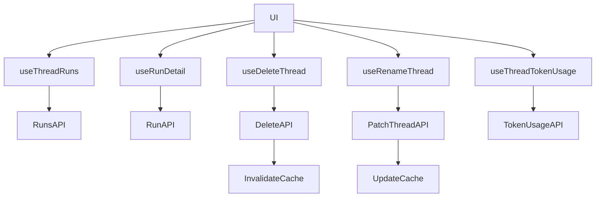
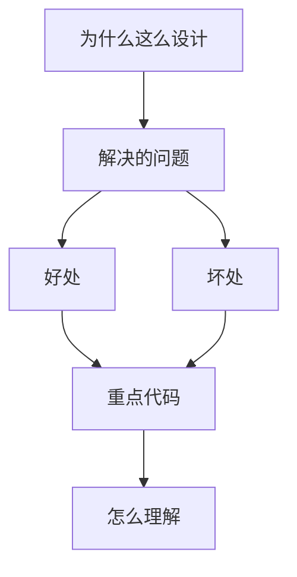

<title>131｜Core Threads Runs、Delete、Rename、Token Usage Hooks 详解</title>

<callout emoji="✅">
**本章目标：**继续拆 frontend 业务模块，说明职责、数据源和运行逻辑。
</callout>

| 模块点 | 说明 |
|-|-|
| useThreadRuns | 读取 thread runs。 |
| useRunDetail | 读取单个 run detail。 |
| useDeleteThread | 删除 thread 并更新缓存。 |
| useRenameThread | 重命名 thread。 |
| useThreadTokenUsage | 读取 thread token usage。 |

---

# 补充：设计取舍、重点代码与阅读路径

<callout emoji="💡">
**设计目的：**该模块用于固化工程流程、质量门禁或设计背景，是为了让行为可复现、可审计。
</callout>

| 维度 | 说明 |
|-|-|
| 收益 | 好处是降低回归风险，帮助新人理解历史决策。 |
| 代价 | 坏处是容易与代码实现漂移，需要持续维护。 |
| 重点代码 | 重点代码/资料是对应 tests、scripts、workflow、docs 文件及其调用的源码入口。 |
| 阅读路径 | 阅读路径：按输入、执行步骤、输出证据三段看。 |

