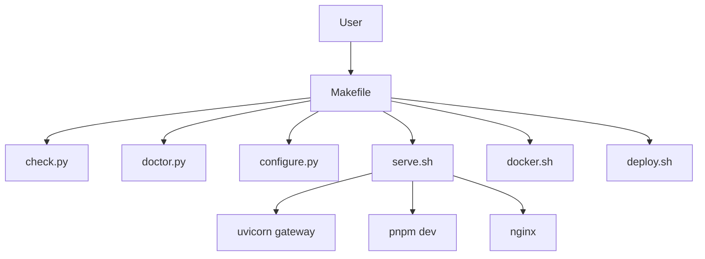
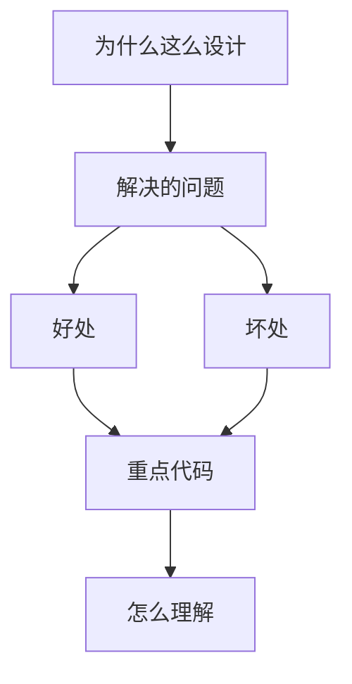

<title>135｜Scripts Setup/Dev/Deploy 脚本详解</title>

<callout emoji="✅">
**本章目标：**补齐测试、脚本、Docker、Skills 分类，解释运行逻辑。
</callout>

| 模块点 | 说明 |
|-|-|
| check.py/doctor.py | 依赖和配置诊断。 |
| configure.py/config-upgrade.sh | 生成和升级 config.yaml。 |
| serve.sh | 本地 dev/prod 服务编排。 |
| docker.sh | Docker 开发模式。 |
| deploy.sh | 生产 Docker 编排。 |
| setup_wizard.py | 交互式初始化。 |

---

# 补充：设计取舍、重点代码与阅读路径

<callout emoji="💡">
**设计目的：**该模块用于固化工程流程、质量门禁或设计背景，是为了让行为可复现、可审计。
</callout>

| 维度 | 说明 |
|-|-|
| 收益 | 好处是降低回归风险，帮助新人理解历史决策。 |
| 代价 | 坏处是容易与代码实现漂移，需要持续维护。 |
| 重点代码 | 重点代码/资料是对应 tests、scripts、workflow、docs 文件及其调用的源码入口。 |
| 阅读路径 | 阅读路径：按输入、执行步骤、输出证据三段看。 |

