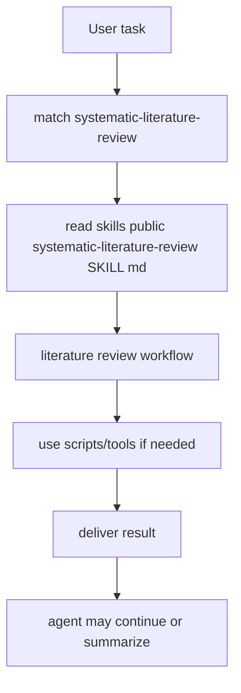
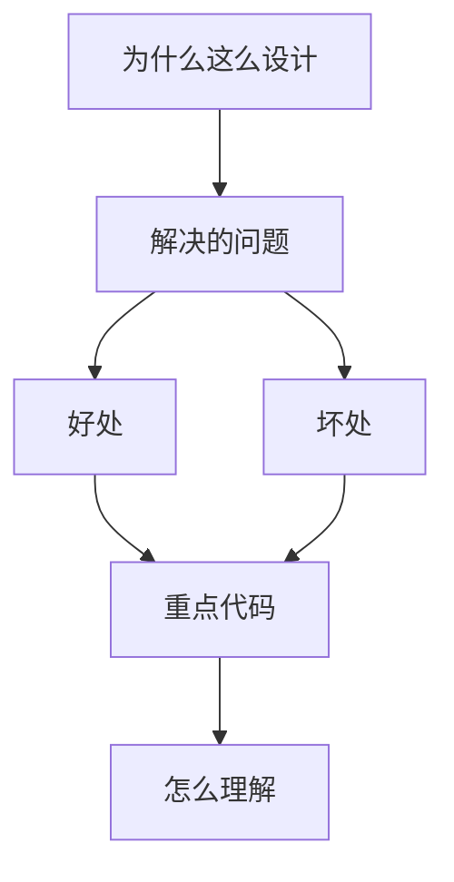

<title>148｜systematic-literature-review Public Skill 详解</title>

<callout emoji="✅">
**Skill 目标：**系统文献综述流程。
</callout>

| 字段 | 说明 |
|-|-|
| Skill 名称 | `systematic-literature-review` |
| 路径 | `skills/public/systematic-literature-review/SKILL.md` |
| 类型 | literature review |
| 触发方式 | 任务匹配或显式 `/systematic-literature-review` |

---

# 补充：设计取舍、重点代码与阅读路径

<callout emoji="💡">
**设计目的：**前端按 route、core 数据层、业务组件、UI primitive 分层，是为了降低组件耦合。
</callout>

| 维度 | 说明 |
|-|-|
| 收益 | 好处是展示层和数据请求分离，组件更容易复用。 |
| 代价 | 坏处是一次用户交互常跨页面、hook、缓存、上下文和组件。 |
| 重点代码 | 重点代码在 `frontend/src/app`、`frontend/src/core`、`frontend/src/components` 对应模块。 |
| 阅读路径 | 阅读路径：先找 route，再找 hook 数据源，最后看组件消费。 |

