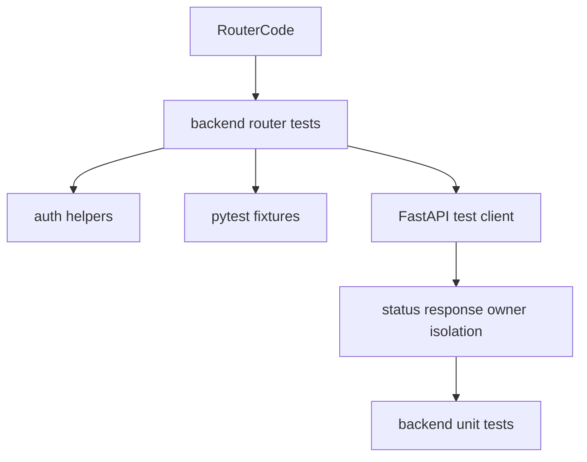
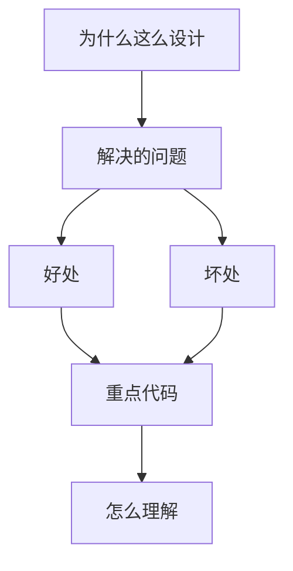

<title>167｜Backend Router Tests 分类详解</title>

<callout emoji="✅">
**本章目标：**继续拆测试/CI/脚本模块，说明覆盖范围、运行入口和逻辑。
</callout>

| 模块点 | 说明 |
|-|-|
| auth/uploads/artifacts/mcp/skills/memory/threads/runs | 各 Gateway router 的请求/响应/权限/边界测试。 |
| owner isolation | 验证跨用户隔离。 |
| OpenAPI operation ids | 保证 API schema 稳定。 |
| router helpers | 复用 auth 和 run message pagination helper。 |

---

# 补充：设计取舍、重点代码与阅读路径

<callout emoji="💡">
**设计目的：**该模块用于固化工程流程、质量门禁或设计背景，是为了让行为可复现、可审计。
</callout>

| 维度 | 说明 |
|-|-|
| 收益 | 好处是降低回归风险，帮助新人理解历史决策。 |
| 代价 | 坏处是容易与代码实现漂移，需要持续维护。 |
| 重点代码 | 重点代码/资料是对应 tests、scripts、workflow、docs 文件及其调用的源码入口。 |
| 阅读路径 | 阅读路径：按输入、执行步骤、输出证据三段看。 |

