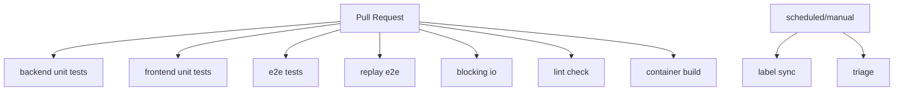
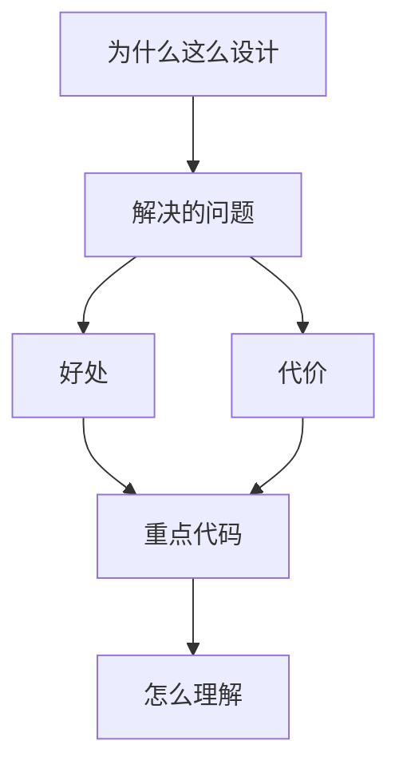

<title>172｜GitHub Workflow 文件逐项详解</title>

<callout emoji="✅">
**本章目标：**继续拆测试/CI/脚本模块，说明覆盖范围、运行入口和逻辑。
</callout>

| 模块点 | 说明 |
|-|-|
| backend-unit-tests.yml | 运行后端测试。 |
| frontend-unit-tests.yml | 运行前端单测/类型。 |
| e2e-tests.yml | Playwright E2E。 |
| replay-e2e.yml | Replay golden。 |
| backend-blocking-io-tests.yml | 阻塞 IO gate。 |
| container.yaml | 容器构建。 |
| label-sync/triage | 项目维护自动化。 |

---

# 补充：设计取舍、重点代码与阅读路径

<callout emoji="💡">
**设计目的：**该模块用于固化工程流程、质量门禁或设计背景，是为了让行为可复现、可审计。
</callout>

| 维度 | 说明 |
|-|-|
| 收益 | 好处是降低回归风险，帮助新人理解历史决策。 |
| 代价 | 坏处是文档/脚本容易随代码实现漂移，需要持续维护。 |
| 重点代码 | 重点代码/资料是对应 tests、scripts、workflow、docs 文件及其调用的源码入口。 |
| 阅读路径 | 阅读路径：按输入、执行步骤、输出证据三段看。 |

