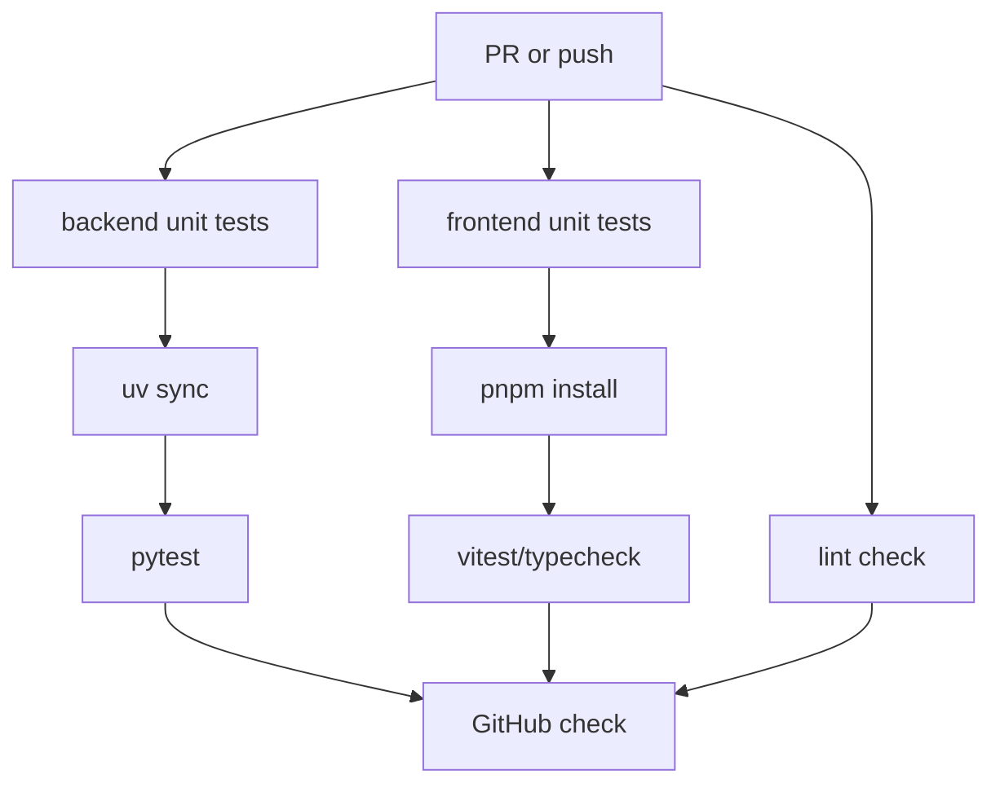
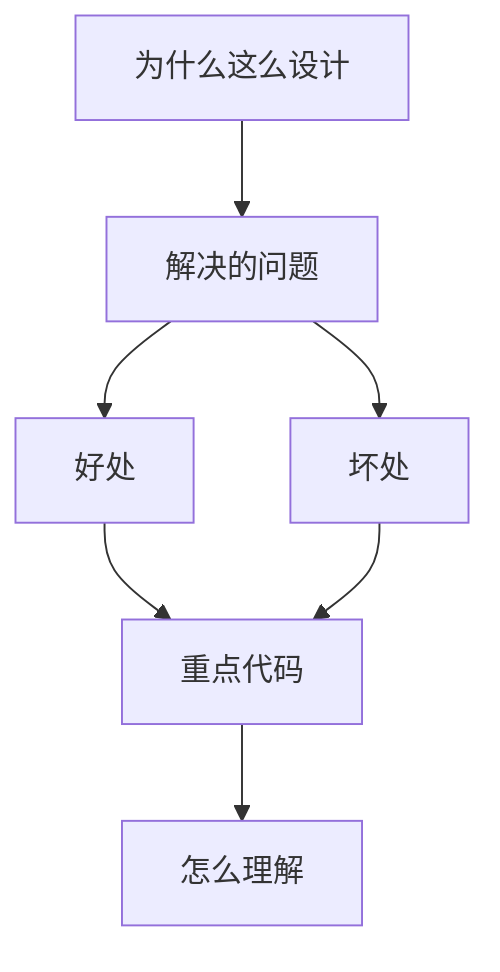

<title>174｜Backend/Frontend Unit Test Workflows 详解</title>

<callout emoji="✅">
**本章目标：**继续拆 CI、脚本、E2E 具体模块，说明触发、执行与产出。
</callout>

| 模块点 | 说明 |
|-|-|
| backend-unit-tests.yml | 安装后端依赖并运行 pytest。 |
| frontend-unit-tests.yml | 安装前端依赖并运行 unit/type/lint。 |
| lint-check.yml | 统一 lint 检查。 |
| 触发 | PR/push 触发质量 gate。 |

---

# 补充：设计取舍、重点代码与阅读路径

<callout emoji="💡">
**设计目的：**该模块用于固化工程流程、质量门禁或设计背景，是为了让行为可复现、可审计。
</callout>

| 维度 | 说明 |
|-|-|
| 收益 | 好处是降低回归风险，帮助新人理解历史决策。 |
| 代价 | 坏处是容易与代码实现漂移，需要持续维护。 |
| 重点代码 | 重点代码/资料是对应 tests、scripts、workflow、docs 文件及其调用的源码入口。 |
| 阅读路径 | 阅读路径：按输入、执行步骤、输出证据三段看。 |

