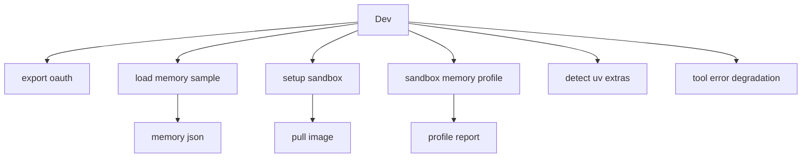
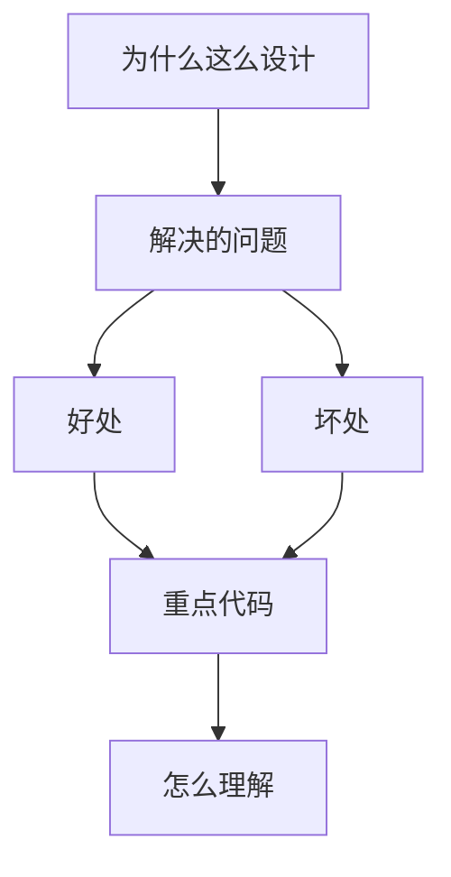

<title>187｜OAuth / Memory / Sandbox / Detection Scripts 详解</title>

<callout emoji="✅">
**本章目标：**继续拆测试/workflow/script 单文件族，说明覆盖目标和运行逻辑。
</callout>

| 模块点 | 说明 |
|-|-|
| export_claude_code_oauth.py | 导出 Claude Code OAuth。 |
| load_memory_sample.py | 加载 memory 示例。 |
| setup-sandbox.sh | 预拉 sandbox 镜像。 |
| sandbox_memory_profile.py | sandbox 内存画像。 |
| detect_uv_extras.py | uv extras 检测。 |
| tool-error-degradation-detection.sh | 工具错误降级检测。 |

---

# 补充：设计取舍、重点代码与阅读路径

<callout emoji="💡">
**设计目的：**该模块用于固化工程流程、质量门禁或设计背景，是为了让行为可复现、可审计。
</callout>

| 维度 | 说明 |
|-|-|
| 收益 | 好处是降低回归风险，帮助新人理解历史决策。 |
| 代价 | 坏处是容易与代码实现漂移，需要持续维护。 |
| 重点代码 | 重点代码/资料是对应 tests、scripts、workflow、docs 文件及其调用的源码入口。 |
| 阅读路径 | 阅读路径：按输入、执行步骤、输出证据三段看。 |

