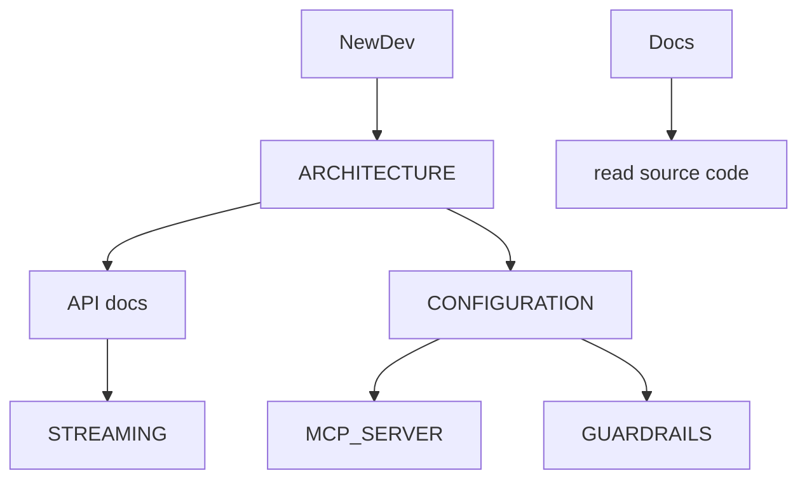
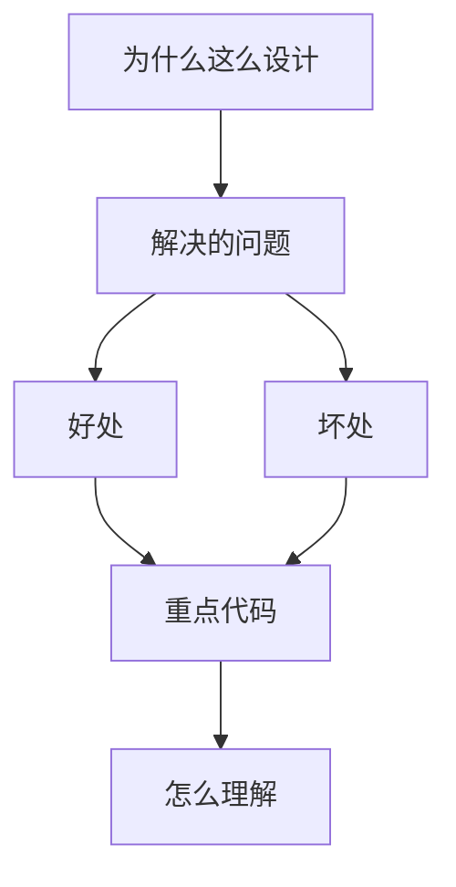

<title>200｜Backend Docs Architecture/API/Config 文档详解</title>

<callout emoji="✅">
**本章目标：**继续补齐剩余测试与文档规格模块。
</callout>

| 模块点 | 说明 |
|-|-|
| ARCHITECTURE.md | 后端架构总览。 |
| API.md | Gateway / LangGraph-compatible API。 |
| CONFIGURATION.md | 配置说明。 |
| MCP_SERVER.md | MCP server 配置。 |
| STREAMING.md | 流式输出说明。 |
| GUARDRAILS.md | 安全 guardrail。 |

---

# 补充：设计取舍、重点代码与阅读路径

<callout emoji="💡">
**设计目的：**该模块用于固化工程流程、质量门禁或设计背景，是为了让行为可复现、可审计。
</callout>

| 维度 | 说明 |
|-|-|
| 收益 | 好处是降低回归风险，帮助新人理解历史决策。 |
| 代价 | 坏处是容易与代码实现漂移，需要持续维护。 |
| 重点代码 | 重点代码/资料是对应 tests、scripts、workflow、docs 文件及其调用的源码入口。 |
| 阅读路径 | 阅读路径：按输入、执行步骤、输出证据三段看。 |

