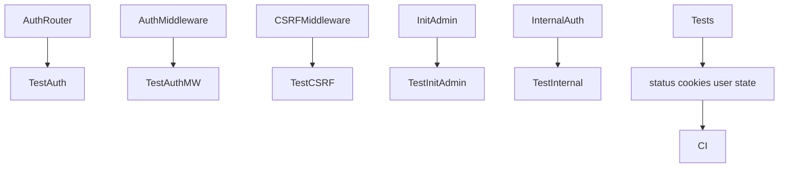
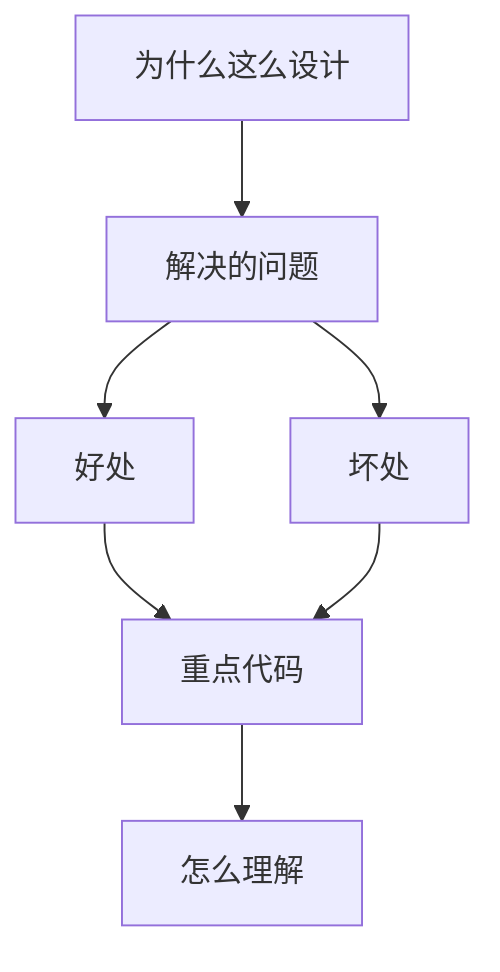

<title>202｜test_auth / auth_middleware / csrf 测试详解</title>

<callout emoji="✅">
**本章目标：**继续拆单测试族、单规格文档和根文档模块。
</callout>

| 模块点 | 说明 |
|-|-|
| test_auth.py | 登录/注册/认证基础。 |
| test_auth_middleware.py | AuthMiddleware 请求边界。 |
| test_csrf_middleware.py | CSRF cookie/header 校验。 |
| test_initialize_admin.py | 首次 admin 初始化。 |
| test_internal_auth.py | 内部认证。 |

---

# 补充：设计取舍、重点代码与阅读路径

<callout emoji="💡">
**设计目的：**这个模块以 API/边界层拆分，是为了隔离 HTTP 协议、认证鉴权、请求模型和内部业务。
</callout>

| 维度 | 说明 |
|-|-|
| 收益 | 好处是前后端契约清晰，接口可独立演进。 |
| 代价 | 坏处是一次功能可能跨 router、service、repository 和前端 hook。 |
| 重点代码 | 重点代码在 `backend/app/gateway/routers/`、`backend/app/gateway/auth/*` 或对应前端 `frontend/src/core/*/api.ts`。 |
| 阅读路径 | 阅读路径：从 URL/API 入口往内追 service，再看数据落到哪里。 |

