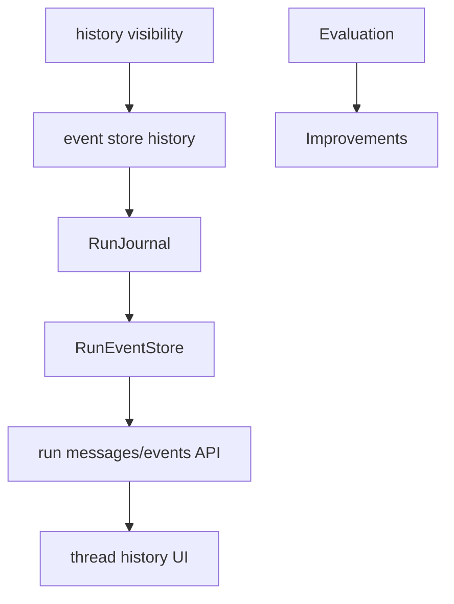
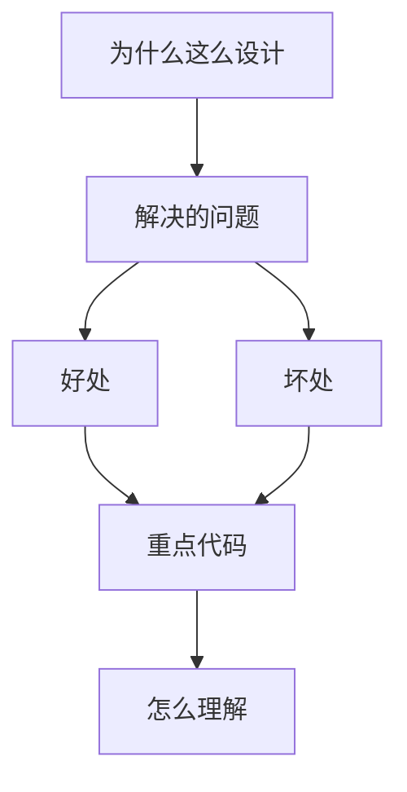

<title>206｜Event Store / History Specs/Plans 详解</title>

<callout emoji="✅">
**本章目标：**继续拆单测试族、单规格文档和根文档模块。
</callout>

| 模块点 | 说明 |
|-|-|
| 2026-04-10-event-store-history.md | event store history plan。 |
| 2026-04-11-runjournal-history-evaluation.md | RunJournal history evaluation。 |
| 目标 | run history/event store 可观测性。 |
| 关联 | runtime/journal、run_event_store、frontend history。 |

---

# 补充：设计取舍、重点代码与阅读路径

<callout emoji="💡">
**设计目的：**该模块用于固化工程流程、质量门禁或设计背景，是为了让行为可复现、可审计。
</callout>

| 维度 | 说明 |
|-|-|
| 收益 | 好处是降低回归风险，帮助新人理解历史决策。 |
| 代价 | 坏处是容易与代码实现漂移，需要持续维护。 |
| 重点代码 | 重点代码/资料是对应 tests、scripts、workflow、docs 文件及其调用的源码入口。 |
| 阅读路径 | 阅读路径：按输入、执行步骤、输出证据三段看。 |

