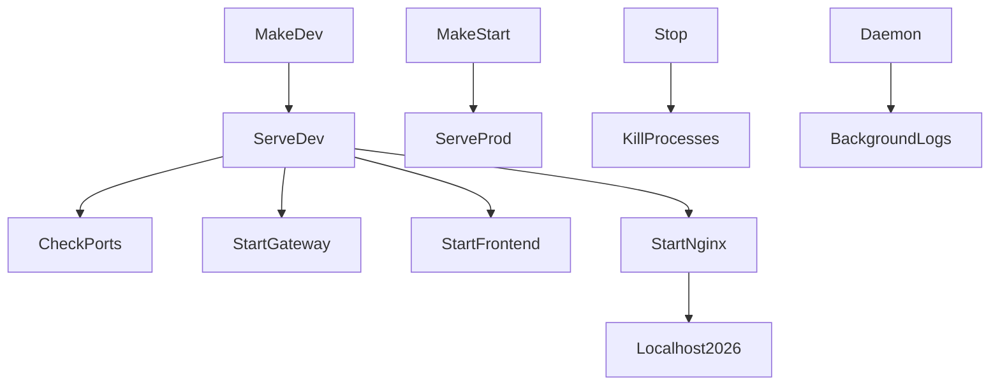
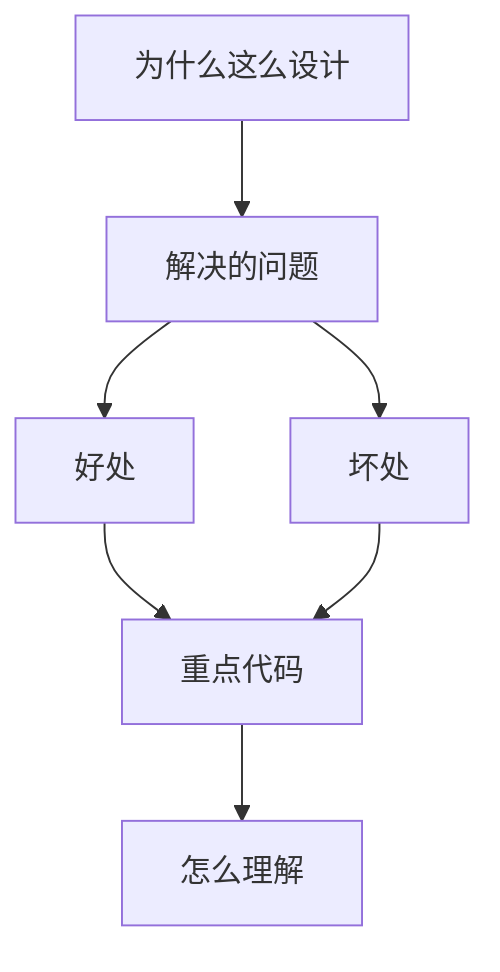

<title>334｜serve.sh 服务生命周期深拆</title>

<callout emoji="✅">
**本章目标：**继续拆 remaining route/content/docker/script 内部模块。
</callout>

| 模块点 | 说明 |
|-|-|
| serve.sh --dev | 开发启动。 |
| serve.sh --prod | 生产启动。 |
| --daemon | 后台运行。 |
| --stop | 停止服务。 |
| logs | gateway/frontend/nginx 日志。 |

---

# 补充：设计取舍、重点代码与阅读路径

<callout emoji="💡">
**设计目的：**该模块用于固化工程流程、质量门禁或设计背景，是为了让行为可复现、可审计。
</callout>

| 维度 | 说明 |
|-|-|
| 收益 | 好处是降低回归风险，帮助新人理解历史决策。 |
| 代价 | 坏处是容易与代码实现漂移，需要持续维护。 |
| 重点代码 | 重点代码/资料是对应 tests、scripts、workflow、docs 文件及其调用的源码入口。 |
| 阅读路径 | 阅读路径：按输入、执行步骤、输出证据三段看。 |

