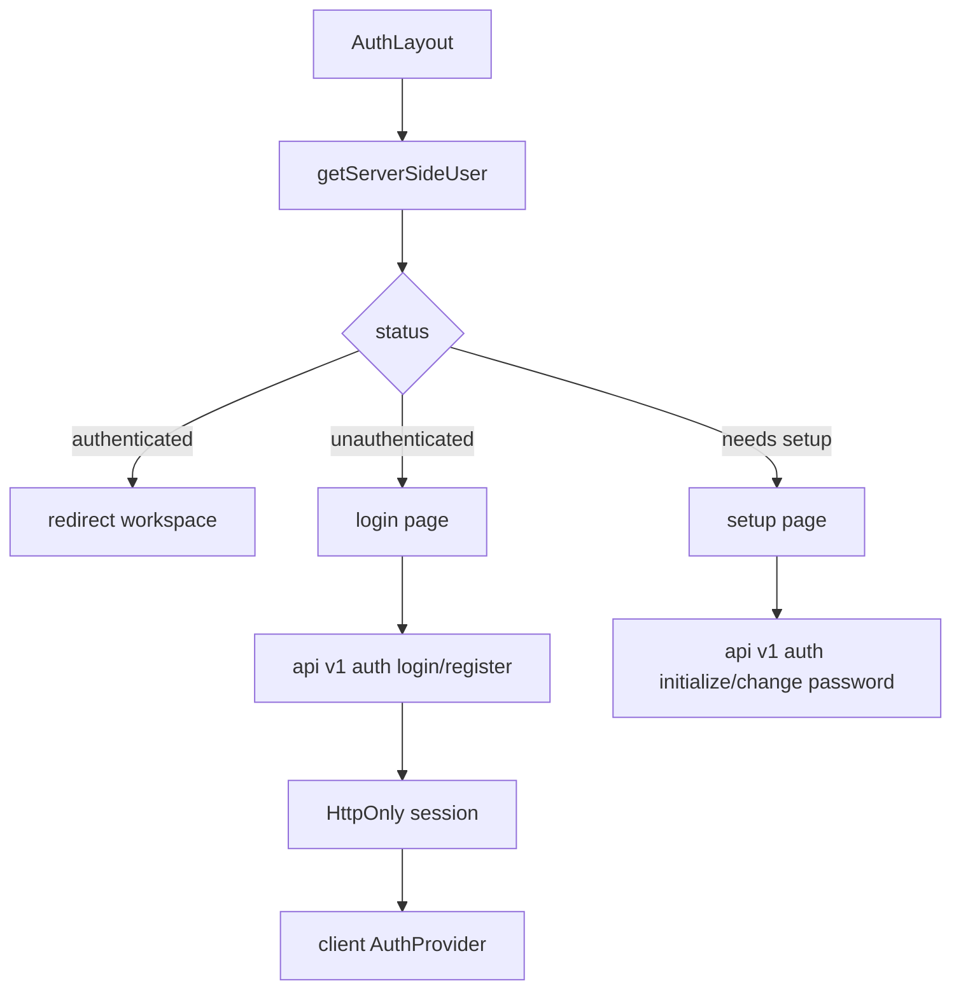
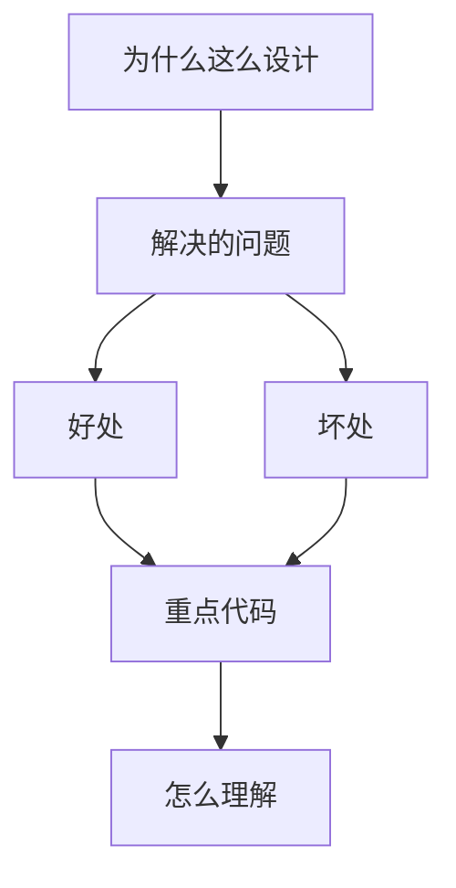

<title>73｜Frontend Auth/Login/Setup 页面详解</title>

<callout emoji="✅">
**本章目标：**讲清前端登录、初始化 admin、修改密码和 Gateway unavailable fallback。
</callout>

# 1. 模块职责

| 模块 | 说明 |
|-|-|
| `app/(auth)/layout.tsx` | 根据 getServerSideUser 判断跳转或渲染。 |
| `login/page.tsx` | 登录/注册表单，调用 auth API。 |
| `setup/page.tsx` | 首次初始化 admin 或强制改密码。 |
| `frontend/src/core/auth/*` | AuthProvider、server user、proxy policy、types。 |

# 2. 运行逻辑图

---

# 补充：设计取舍、重点代码与阅读路径

<callout emoji="💡">
**设计目的：**前端按 route、core 数据层、业务组件、UI primitive 分层，是为了降低组件耦合。
</callout>

| 维度 | 说明 |
|-|-|
| 收益 | 好处是展示层和数据请求分离，组件更容易复用。 |
| 代价 | 坏处是一次用户交互常跨页面、hook、缓存、上下文和组件。 |
| 重点代码 | 重点代码在 `frontend/src/app`、`frontend/src/core`、`frontend/src/components` 对应模块。 |
| 阅读路径 | 阅读路径：先找 route，再找 hook 数据源，最后看组件消费。 |

