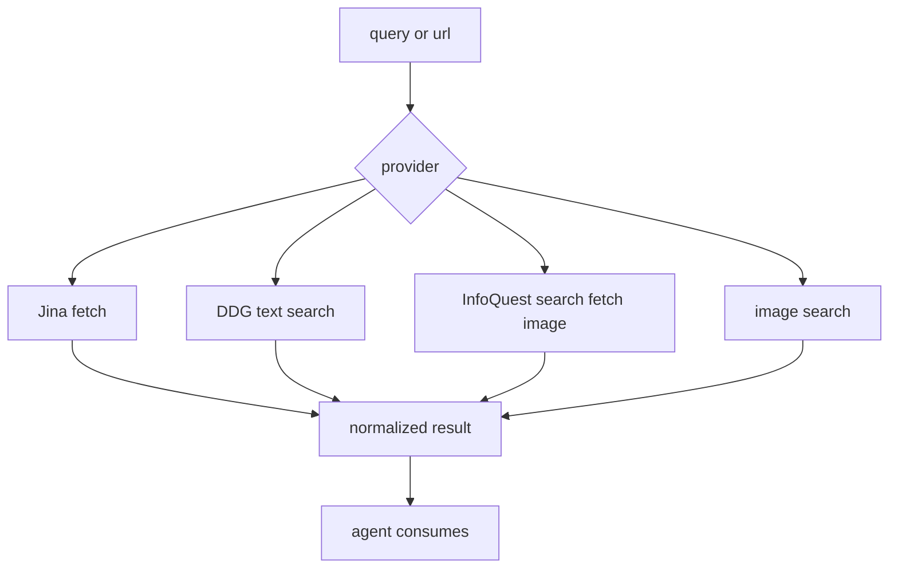
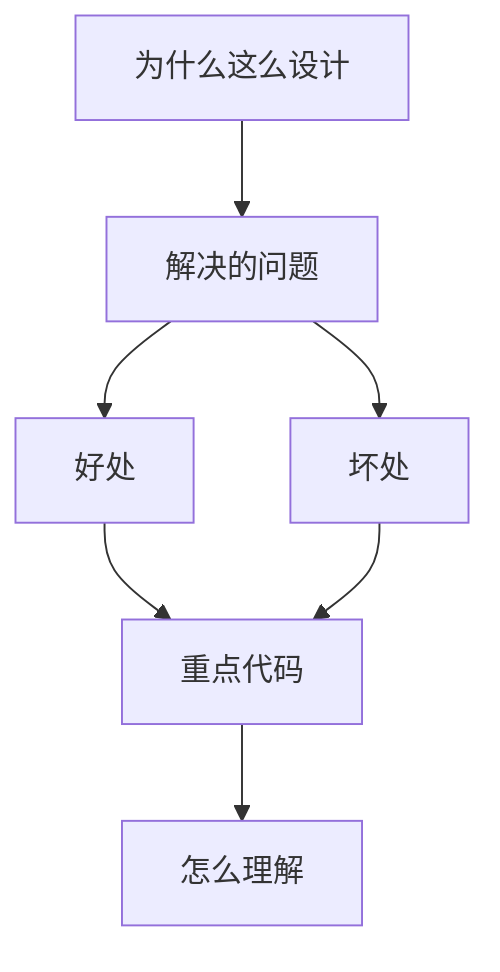

<title>79｜Jina、DDG、InfoQuest、Image Search Provider 详解</title>

<callout emoji="✅">
**本章目标：**补齐其余搜索、抓取、图片搜索 provider。
</callout>

| 模块点 | 说明 |
|-|-|
| Jina AI | 异步 web_fetch，coerce timeout/proxy。 |
| DDG Search | 文本搜索，region/backend/Wikipedia 推断。 |
| InfoQuest | search/fetch/image_search 三类能力。 |
| Image Search | 图片搜索工具，返回图片候选。 |

---

# 补充：设计取舍、重点代码与阅读路径

<callout emoji="💡">
**设计目的：**前端按 route、core 数据层、业务组件、UI primitive 分层，是为了降低组件耦合。
</callout>

| 维度 | 说明 |
|-|-|
| 收益 | 好处是展示层和数据请求分离，组件更容易复用。 |
| 代价 | 坏处是一次用户交互常跨页面、hook、缓存、上下文和组件。 |
| 重点代码 | 重点代码在 `frontend/src/app`、`frontend/src/core`、`frontend/src/components` 对应模块。 |
| 阅读路径 | 阅读路径：先找 route，再找 hook 数据源，最后看组件消费。 |

