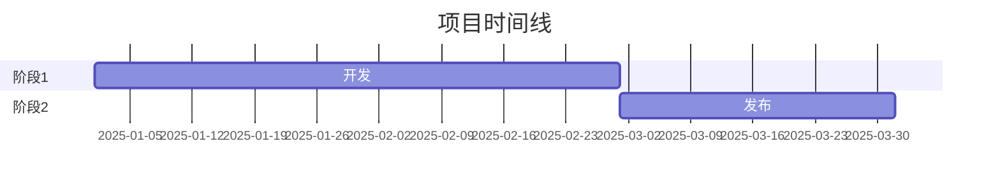
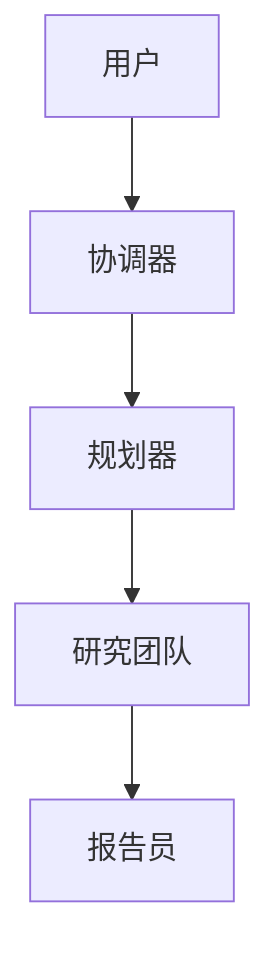
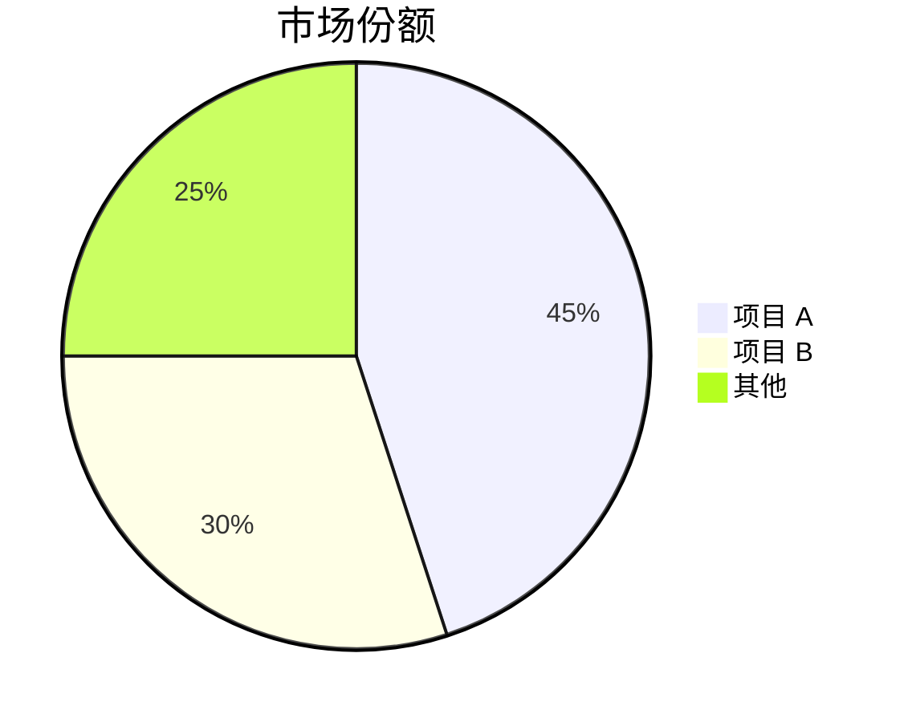

# GitHub 深度研究技能

结合 GitHub API、web_search、web_fetch 进行多轮研究，生成全面的 markdown 报告。

## 研究工作流

- 第一轮：GitHub API
- 第二轮：发现
- 第三轮：深度调查
- 第四轮：深入挖掘

## 核心方法论

### 查询策略

**从广到窄**：从 GitHub API 开始，然后进行通用查询，根据发现进行细化。

```
第一轮：GitHub API
第二轮："{topic} overview"
第三轮："{topic} architecture", "{topic} vs alternatives"
第四轮："{topic} issues", "{topic} roadmap", "site:github.com {topic}"
```

**来源优先级**：
1. 官方文档/仓库（最高权重）
2. 技术博客（Medium, Dev.to）
3. 新闻文章（验证过的媒体）
4. 社区讨论（Reddit, HN）
5. 社交媒体（最低权重，用于情感）

### 研究轮次

**第一轮 - GitHub API**
直接执行 `scripts/github_api.py`，无需 `read_file()`：
```bash
python /path/to/skill/scripts/github_api.py <owner> <repo> summary
python /path/to/skill/scripts/github_api.py <owner> <repo> readme
python /path/to/skill/scripts/github_api.py <owner> <repo> tree
```

**可用命令（`github_api.py` 的最后一个参数）：**
- summary
- info
- readme
- tree
- languages
- contributors
- commits
- issues
- prs
- releases

**第二轮 - 发现（3-5 次 web_search）**
- 获取概览并识别关键术语
- 查找官方网站/仓库
- 识别主要参与者/竞争对手

**第三轮 - 深度调查（5-10 次 web_search + web_fetch）**
- 技术架构细节
- 关键事件时间线
- 社区情感
- 对有价值的 URL 使用 web_fetch 获取完整内容

**第四轮 - 深入挖掘**
- 分析提交历史以获取时间线
- 审查 issues/PRs 以了解功能演进
- 检查贡献者活动

## 报告结构

遵循 `assets/report_template.md` 中的模板：

1. **元数据块** - 日期、置信度水平、主题
2. **执行摘要** - 2-3 句概览配关键指标
3. **按时间顺序的时间线** - 分阶段细分配日期
4. **关键分析部分** - 特定主题的深入探讨
5. **指标与比较** - 表格、增长图表
6. **优势与劣势** - 平衡评估
7. **来源** - 分类参考
8. **置信度评估** - 按置信度水平的声明
9. **方法论** - 使用的研究方法

### Mermaid 图表

在有帮助的地方包含图表：

**时间线（甘特图）**：


**架构（流程图）**：


**比较（饼图/条形图）**：


## 置信度评分

根据来源质量分配置信度：

| 置信度 | 标准 |
|------------|----------|
| 高（90%+） | 官方文档、GitHub 数据、多个相互印证的来源 |
| 中（70-89%） | 单一可靠来源、近期文章 |
| 低（50-69%） | 社交媒体、未验证声明、过时信息 |

## 输出

保存报告为：`research_{topic}_{YYYYMMDD}.md`

### 格式规则

- 中文内容：使用全角标点（，。：；！？）
- 技术术语：首次提及时提供 Wiki/doc URL
- 表格：用于指标、比较
- 代码块：用于技术示例
- Mermaid：用于架构、时间线、流程

## 最佳实践

1. **从官方来源开始** - 仓库、文档、公司博客
2. **从提交/PRs 验证日期** - 比文章更可靠
3. **三角验证声明** - 2+ 独立来源
4. **注意冲突信息** - 不要隐藏矛盾
5. **区分事实与观点** - 清楚标记推测
6. **引用来源** - 在声明附近添加来源引用
7. **边做边更新** - 不要等到最后才综合
